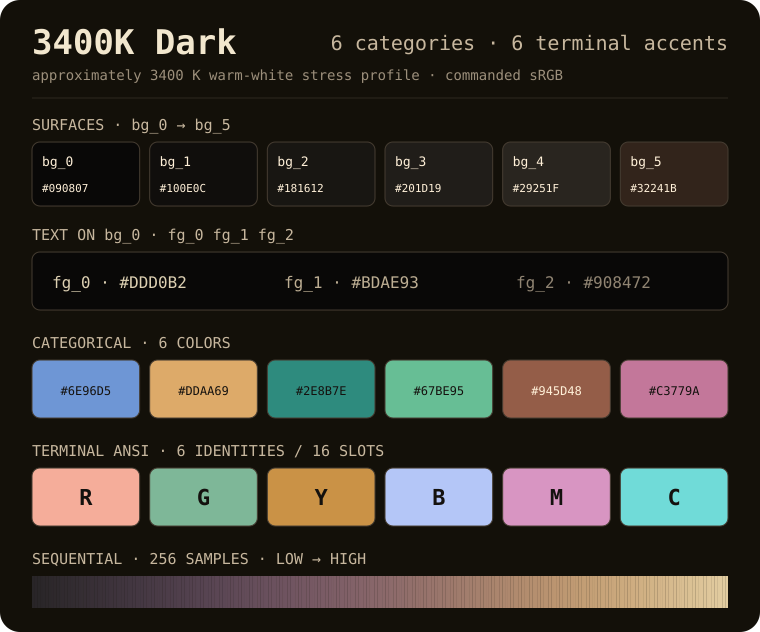
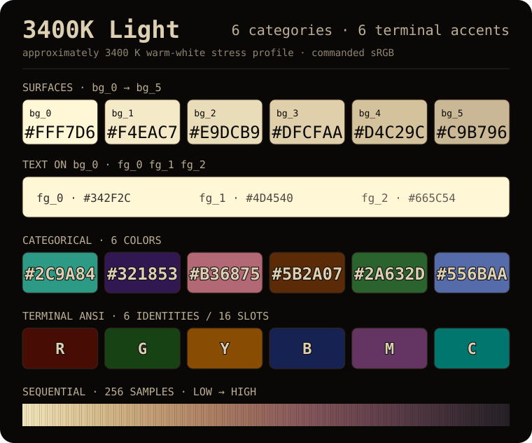
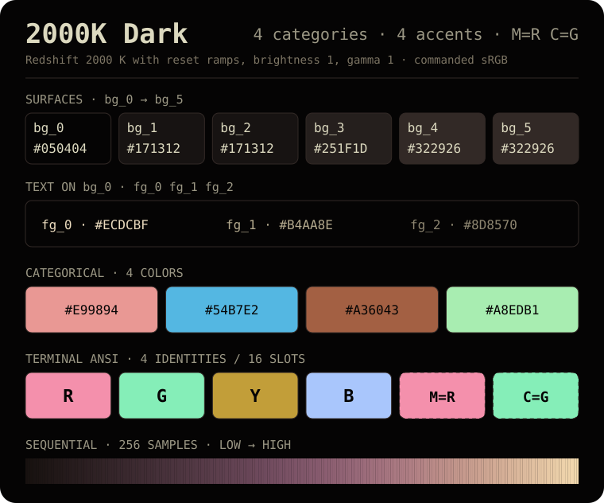
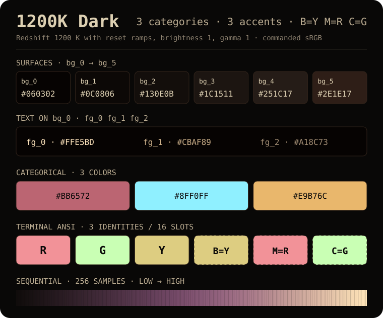
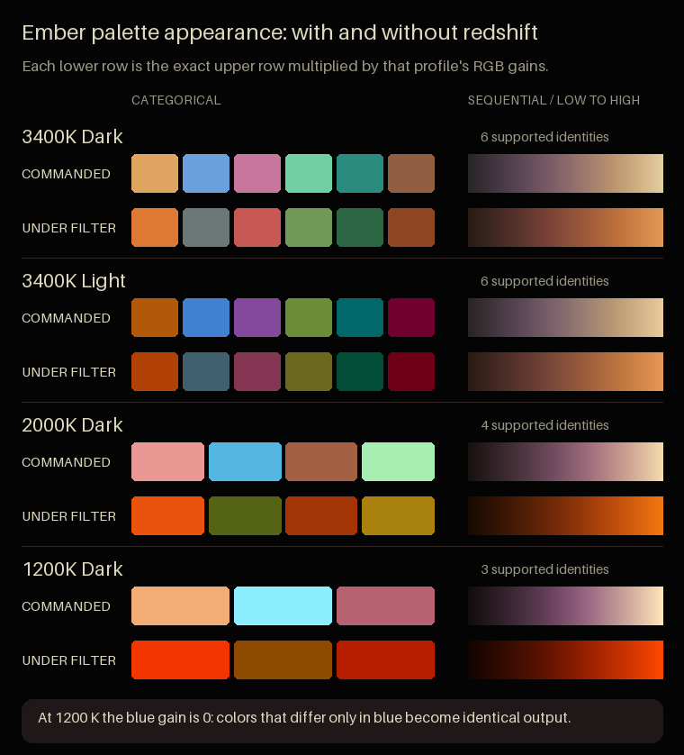
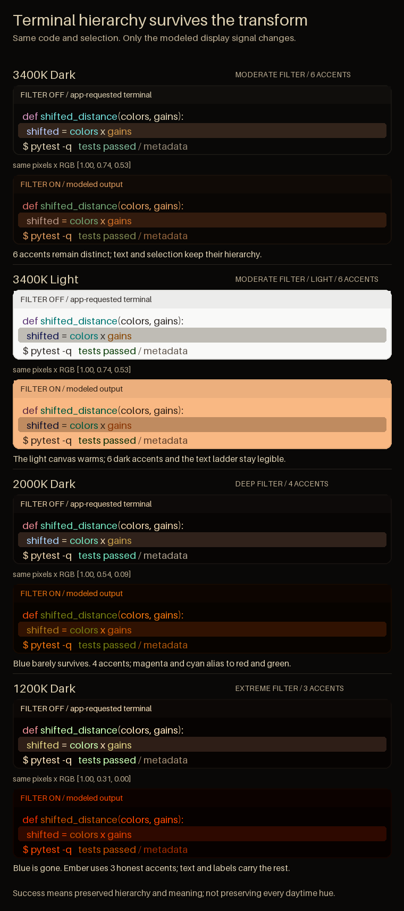
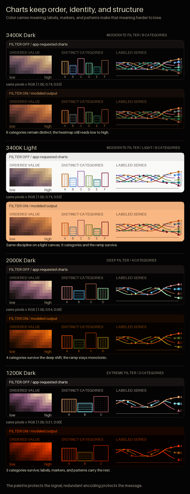
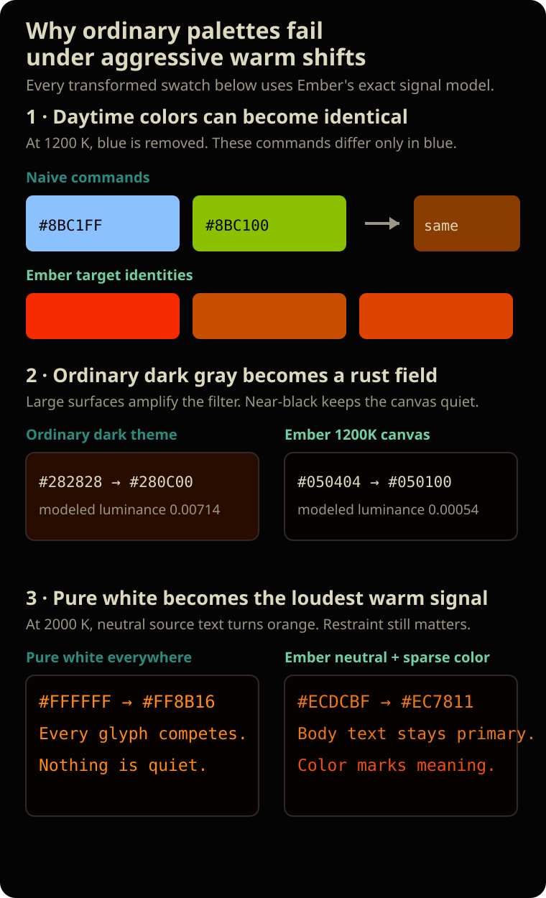

# Ember: Nightshift / Redshift safe color palettes

[See it live](https://www.usuallypragmatic.com/ember/)

**Color palettes for terminals, interfaces, charts, and heatmaps that keep text
readable and semantic colors distinct through aggressive warm-screen filtering.**

Warm-screen filters change each RGB channel by a different amount, causing ordinary
colors to collide. Ember provides four palettes with neutral or warm-neutral text and surfaces,
distinct categorical and terminal colors, and 256-sample sequential maps. Each palette
maintains its specified contrast, perceptual separation, and ordered lightness in
unfiltered output and after its modeled 3400 K, 2000 K, or 1200 K transform.

Ember supplies the colors; keep using Night Shift, Redshift, or the warm-screen filter
you already have.

[](https://github.com/carpdiem/ember/actions/workflows/ci.yml)
[](LICENSE)
[](pyproject.toml)

## The four palettes

### 3400K Dark



### 3400K Light



3400K Dark and 3400K Light use mode-specific 256-sample sequential maps while preserving
one scalar polarity: low values are dark and high values are bright in both modes. The light
map is tuned for even daytime progression against its neutral surface system.
The 3400K Light categorical bank spans red, amber, green, teal, blue, and violet while
reserving the commanded Oklch hue arc from 92° through 118°.
[Production provenance](docs/provenance/3400k-light-forbidden-arc-new-a.json)
pins the accepted exact Hex bank and browser evidence.
Category slots are cross-theme assignments: keep series IDs and category indices unchanged
when switching between 3400K Dark and 3400K Light so each graph series retains its identity.

### 2000K Dark



### 1200K Dark



These are the exact commanded sRGB values shipped in every export. Deeper filters
leave fewer color identities available, so unsupported ANSI names intentionally
share supported colors and are labeled as aliases.

## With and without redshift



Each pair shows the colors sent to the display followed by a deterministic simulation
of the modeled filtered output.

### In a terminal



### In charts and heatmaps



### Why warm filters merge colors


A warm filter multiplies red, green, and blue by different gains. At Ember's 1200 K
model the blue gain is zero, so colors that differ only in blue produce identical
output. The deeper palettes therefore provide fewer semantic color identities, and
unsupported ANSI names intentionally share supported colors.

Filtered rows are deterministic signal simulations — commanded sRGB multiplied by
each transform's published gains. They are not photographs, calibrated physical color
temperatures, or predictions of every display pipeline. Turn off any active warm
filter before judging them, or your screen applies the transform a second time.

## Choose a palette

| Palette | Choose it for | BG colors | FG colors | Categories | Terminal accents |
|---|---|---:|---:|---:|---:|
| [`3400k-dark`](#3400k-dark) | general-purpose dark interfaces | 5 | 3 | 6 | 6 |
| [`3400k-light`](#3400k-light) | neutral daytime light interfaces | 6 | 3 | 6 | 6 |
| [`2000k-dark`](#2000k-dark) | Redshift near 2000 K | 4 | 3 | 4 | 4 |
| [`1200k-dark`](#1200k-dark) | extreme 1200 K filtering | 4 | 3 | 3 | 3 |

BG counts are unique colors. Every palette still exports all six `bg_0…bg_5` role names;
deeper dark palettes intentionally alias adjacent roles.

Start with `3400k-dark` for a dark interface or `3400k-light` for a light one. Choose
`2000k-dark` or `1200k-dark` only when your filter runs near those deeper settings.
Only dark palettes are provided at 2000 K and 1200 K because a deeply filtered light
canvas becomes a large orange-red field.

## Contents

- [The four palettes](#the-four-palettes): [3400K Dark](#3400k-dark) · [3400K Light](#3400k-light) · [2000K Dark](#2000k-dark) · [1200K Dark](#1200k-dark)
- [With and without redshift](#with-and-without-redshift): [terminal](#in-a-terminal) · [charts and heatmaps](#in-charts-and-heatmaps) · [why colors merge](#why-warm-filters-merge-colors)
- [Choose a palette](#choose-a-palette)
- [Do's and Don'ts](https://www.usuallypragmatic.com/ember/#rules)
- [Install and use Ember](#install-and-use-ember): [get the files](#1-get-the-files) · [terminal themes](#2-import-a-terminal-theme) · [UI roles](#3-use-the-ui-surface-roles) · [Matplotlib](#matplotlib) · [CSS](#css)
- [The science behind Ember](#the-science-behind-ember)
- [Verification](#verification) · [References](#references) · [License](#license)

## Install and use Ember

### 1. Get the files

For terminal themes, CSS, and the JSON manifest:

```bash
git clone https://github.com/carpdiem/ember.git
cd ember
```

Python users can skip the clone and install directly from GitHub:

```bash
python -m pip install "ember-palettes @ git+https://github.com/carpdiem/ember.git"
```

### 2. Import a terminal theme

- **Alacritty:** copy one file from [`themes/terminal/alacritty/`](themes/terminal/alacritty/)
  into your config directory, then import it from `alacritty.toml`:

  ```bash
  mkdir -p ~/.config/alacritty/themes
  cp themes/terminal/alacritty/3400k-dark.toml ~/.config/alacritty/themes/
  ```

  ```toml
  [general]
  import = ["~/.config/alacritty/themes/3400k-dark.toml"]
  ```

- **iTerm2:** open **Settings → Profiles → Colors → Color Presets… → Import…** and
  choose a file from [`themes/terminal/iterm2/`](themes/terminal/iterm2/).
- **Windows Terminal:** open **Settings → Open JSON file**, copy one object from
  [`themes/terminal/windows-terminal/`](themes/terminal/windows-terminal/) into the root
  `schemes` array, then set your profile's `colorScheme` to its exact `name`.

The [terminal guide](themes/terminal/README.md) has the complete import steps and explains
how reduced ANSI banks behave under the deep palettes.

### 3. Use the UI surface roles

Every palette exposes the same ordered roles in JSON, CSS, and the Python `surfaces()` API.
Dark palettes can map adjacent roles to one designed surface when the filter cannot preserve a
useful extra step. The manifest records the unique surfaces and the role-to-surface indices.

| Role | Intended use |
|---|---|
| `bg_0` | base application canvas |
| `bg_1` | low-emphasis adjacent region or sidebar |
| `bg_2` | ordinary panel or card |
| `bg_3` | nested panel, active control, or hover state |
| `bg_4` | floating panel, menu, or popover |
| `bg_5` | selected row, range, or focused region |
| `fg_0` | primary text and essential labels |
| `fg_1` | larger supporting text or graphics; not normal-size body text |
| `fg_2` | muted, nonessential metadata or decoration |

The six role names form a nondecreasing ladder. `bg_0` is always the canvas and `bg_5` is
the strongest background state. The 3400K Dark mapping is `[0,1,2,3,4,4]`; the 2000K
and 1200K Dark mapping is `[0,1,1,2,3,3]`. If an aliased boundary must remain visible,
add a border, spacing, icon, or state mark. Do not invent another surface color.

Use `fg_0` for body text and essential labels. Use `fg_1` for supporting text or larger
graphics. Use `fg_2` only for nonessential metadata or decoration. Do not dim text with
opacity, and do not alpha-compose foreground roles onto surfaces. Both operations create
colors outside the measured contract.

### Matplotlib

For a sequential map:

```python
import matplotlib.pyplot as plt

from ember import sequential

fig, ax = plt.subplots()
ax.imshow([[0.0, 0.4], [0.7, 1.0]], cmap=sequential("3400k-dark"))
plt.show()
```

For categorical data:

```python
import matplotlib.pyplot as plt

from ember import categorical, categorical_norm, encode_categories, surfaces

palette = "3400k-dark"
labels = ["control", "alpha", "beta", "gamma"]
category_ids = encode_categories(labels, labels, slug=palette)
ui = surfaces(palette)

fig, ax = plt.subplots()
fig.patch.set_facecolor(ui["bg_0"])
ax.set_facecolor(ui["bg_2"])
ax.scatter(
    [1, 2, 3, 4],
    [1.2, 2.4, 1.8, 3.1],
    c=category_ids,
    cmap=categorical(palette),
    norm=categorical_norm(palette),
)
plt.show()
```

Pass the palette slug to `categorical_norm()` and `encode_categories()` so their
capacity checks match the selected palette. Sequential maps always expose 256 canonical
float samples, independent of the number of categorical colors.

### CSS

Load [`ember.css`](palettes/ember.css), then select a family:

```html
<link rel="stylesheet" href="/path/to/ember.css">
```

```html
<section data-ember-palette="3400k-dark">
  <div class="panel">...</div>
</section>
```

```css
[data-ember-palette] {
  color: var(--ember-fg-0);
  background: var(--ember-bg-0);
}

.panel {
  background: var(--ember-bg-2);
}

.panel:hover {
  background: var(--ember-bg-3);
}

.popover {
  background: var(--ember-bg-4);
}

.selected {
  background: var(--ember-bg-5);
}

.series-a {
  color: var(--ember-category-one);
}

.heatmap-key {
  background: var(--ember-sequential);
}
```

CSS exposes eleven representative 8-bit gradient stops. The schema-14
[JSON manifest](palettes/ember.json) and Python package preserve all
256 canonical float samples, along with unique surfaces, six-role aliases, foreground
usage rules, categorical semantics, ANSI slots, gain profiles, and measured results.

## The science behind Ember

Ember designs for the filtered state first. It protects contrast, hierarchy, and color
identity after a warm-screen filter removes much of the green and blue signal. It then
uses the remaining RGB freedom to improve the unfiltered palette without weakening the
filtered result.

### 1. The model defines relationships, not physical color

Ember models a warm filter as an independent gain on each encoded sRGB channel:

```text
[display R, display G, display B]
  = [commanded R, commanded G, commanded B] × [gain R, gain G, gain B]
```

| Profile | RGB gains | Basis |
|---|---:|---|
| `3400k` | `[1.00, 0.74, 0.53]` | warm-white engineering surrogate |
| `2000k` | `[1.0000, 0.5436, 0.0868]` | pinned Redshift signal LUT |
| `1200k` | `[1.0000, 0.3094, 0.0000]` | pinned Redshift signal LUT |

The 2000K and 1200K gains use reset Redshift ramps, brightness 1, and gamma 1. At
1200K, blue contributes nothing to the modeled output. Colors that differ only in blue
then become identical.


The model gives every Ember consumer the same signal-level test. It is not a calibrated
prediction of a physical Kelvin value. Panel hardware, operating-system behavior,
calibration, brightness, and ambient light still affect what you see.

### 2. The constrained state comes first

Day and filtered output are two views of one commanded color. A strong daytime result
cannot compensate for a filtered collision, so Ember does not average them into one score.

1. Set floors for filtered contrast, lightness order, and perceptual separation.
2. Find commanded colors that meet those floors.
3. Use signal dimensions that the filter removes or attenuates to improve the commanded
   appearance.

At 1200K, blue can improve daytime identity without changing the modeled filtered result.
At 2000K, a small blue residual remains, so that freedom is narrower. Dense, frequent pixels
stay neutral or warm-neutral. Chroma is reserved for links, status, syntax, and data.

Commanded authoring geometry is measured in Oklab. Filtered separation and sequential
spacing are measured in flare-aware CAM16-UCS under documented viewing conditions. WCAG
contrast remains a separate legibility gate.



### 3. Six role names can use fewer real surfaces

Every family exports `bg_0` through `bg_5`. Consumers can therefore keep one semantic
interface contract. The dark palettes use fewer unique surfaces where an extra filtered
step would not remain useful:

- 3400K Dark: five real surfaces with role indices `[0,1,2,3,4,4]`;
- 2000K Dark and 1200K Dark: four real surfaces with role indices `[0,1,1,2,3,3]`;
- 3400K Light: six real surfaces with role indices `[0,1,2,3,4,5]`.

The aliases are explicit in schema 14. If an aliased boundary carries meaning, add a
border, spacing, icon, or state mark. Do not invent an unmeasured surface color.

### 4. Foregrounds and categories have strict jobs

`fg_0` carries body text and essential labels. `fg_1` carries supporting text or larger
graphics. `fg_2` carries nonessential metadata and decoration. Do not use `fg_2` for body
text. Do not fade text with opacity or alpha-compose a foreground onto a surface. Both
operations create a color outside the measured contract.

Filtered color capacity is finite. Ember supports six categorical and terminal identities
at 3400K, four at 2000K, and three at 1200K. Unsupported ANSI names intentionally alias
supported identities. Category slots keep a stable broad identity across the dark profiles,
including a human-reviewed 2000K ordering.

Use no more than the supported category count. Keep terminal colors for terminal semantics
and categorical colors for data. Add direct labels, position, markers, dash patterns, or
texture when identity is critical.


### 5. Sequential maps preserve scalar meaning

Each palette carries a canonical 256-sample float-sRGB map. Low values are dark and high
values are bright in every mode. CSS and Hex8 exports are lower-precision previews.

The dark maps preserve an approved Oklab path, including its endpoints, hue trajectory, and
chroma envelope. Their sample density then balances commanded and filtered step uniformity.
The 3400K and 2000K maps stop when filtered variation is perceptually sufficient and use the
remaining freedom to improve commanded spacing. The 1200K map minimizes the worst sampled-gain
variation while keeping both states monotonic.

Map the source according to what it means. A photograph maps through Oklab lightness. A
physical scalar field maps its real normalized values directly. Do not apply an image-lightness
stretch to elevation, temperature, pressure, or another measured scalar.

### 6. The checks describe exact serialized values

Release metrics are recomputed from the Hex8 accents and canonical float ramps that consumers
receive. The manifest retains the four ±5% green/blue gain corners and adds a nominal/±5%
CAM16-UCS gain grid for the transformed-first contracts. These samples show nearby
sensitivity. They are not extrema over every point in the gain box, and they are not
display calibration measurements.

The build checks role aliases, foreground use, categorical and terminal separation, WCAG
contrast, CAM16-UCS spacing, sequential monotonicity, package exports, and generated assets.
[Read the measured properties and exact release gates](docs/validation.md).

## Verification

The generated manifest records the measured category spacing, terminal separation,
foreground coherence, surface contrast, sequential-map uniformity, and ±5% gain-corner
sensitivity for every palette. [Read the measured properties and exact release
gates](docs/validation.md).

Reproduce the release checks locally:

```bash
uv sync --extra dev --extra experiment
uv run python tools/build_all.py --check
uv run pytest -q
uv run ruff check src tests tools examples
uv build
```

Deferred work is tracked in [docs/future-work.md](docs/future-work.md).

## References

- Gruvbox, [original project and palette](https://github.com/morhetz/gruvbox): warm
  neutrals, sufficient contrast, and restrained accents for sustained use.
- MIT 6.813, [Color](https://web.mit.edu/6.813/www/sp18/classes/15-color/): chromatic
  aberration, the lower spatial resolution of chromatic channels, sparse color, and
  restrained saturation.
- Fan et al. (2024), [The Effect of Ambient Illumination and Text Color on Visual
  Fatigue under Negative Polarity](https://doi.org/10.3390/s24113516): controlled
  evidence that text color and ambient illumination affect fatigue under dark polarity.
- EU Data Visualisation Guide,
  [Colour for categories](https://data.europa.eu/apps/data-visualisation-guide/colour-for-categories):
  limit categorical count and avoid overly saturated or bright colors.
- Datawrapper,
  [What to consider when choosing colors](https://www.datawrapper.de/academy/what-to-consider-when-choosing-colors-for-data-visualization):
  use neutral structure, protect small-text contrast, and add redundant cues.
- Redshift, [pinned color-ramp implementation](https://github.com/jonls/redshift/blob/490ba2aae9cfee097a88b6e2be98aeb1ce990050/src/colorramp.c)
  and [temperature table](https://github.com/jonls/redshift/blob/490ba2aae9cfee097a88b6e2be98aeb1ce990050/README-colorramp).
- Björn Ottosson,
  [A perceptual color space for image processing](https://bottosson.github.io/posts/oklab/).
- Matplotlib, [Choosing Colormaps](https://matplotlib.org/stable/users/explain/colors/colormaps.html).
- W3C WAI,
  [Understanding contrast minimum](https://www.w3.org/WAI/WCAG21/Understanding/contrast-minimum.html).

## License

MIT © 2026 Michael Woods.