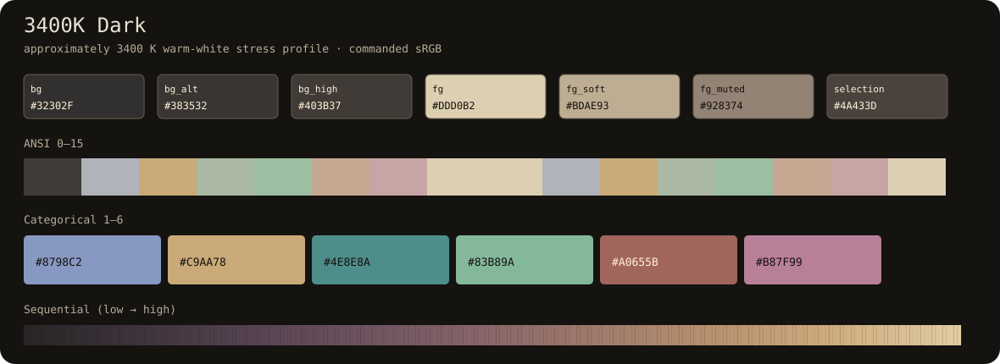
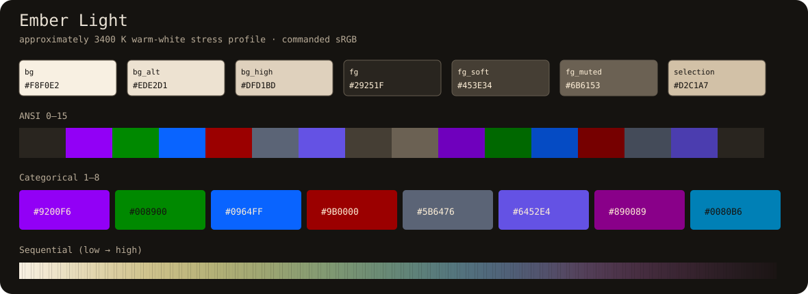
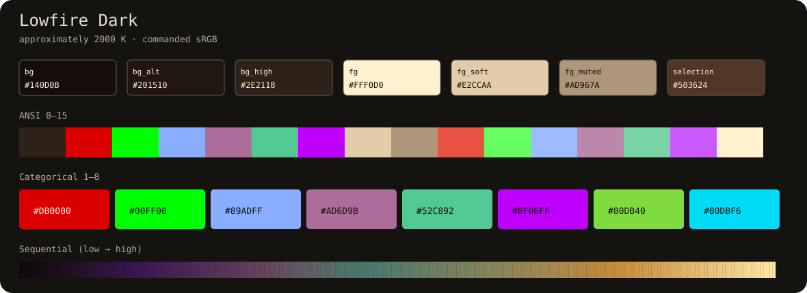
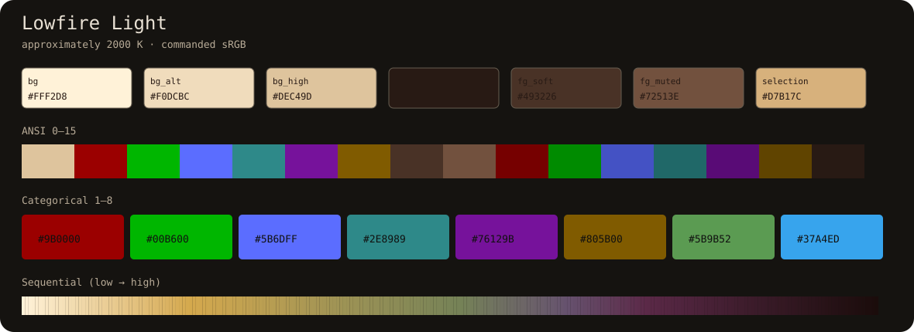
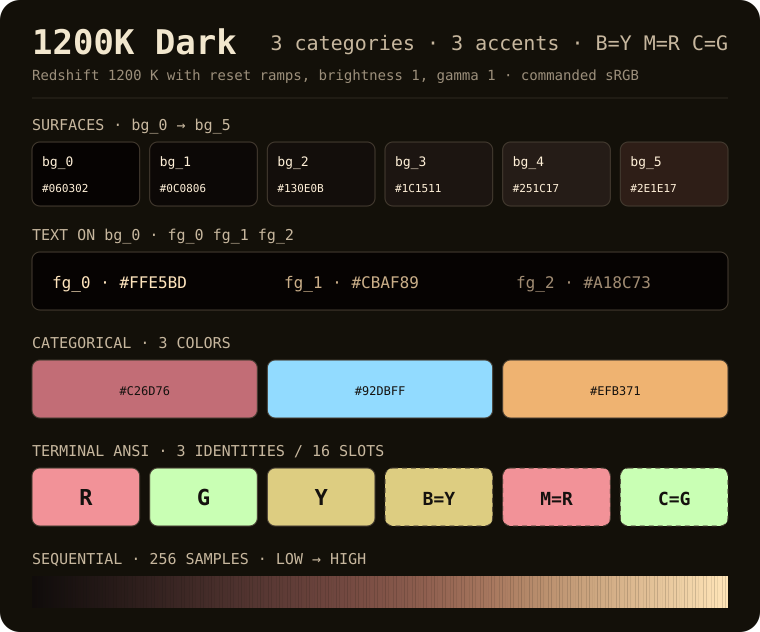
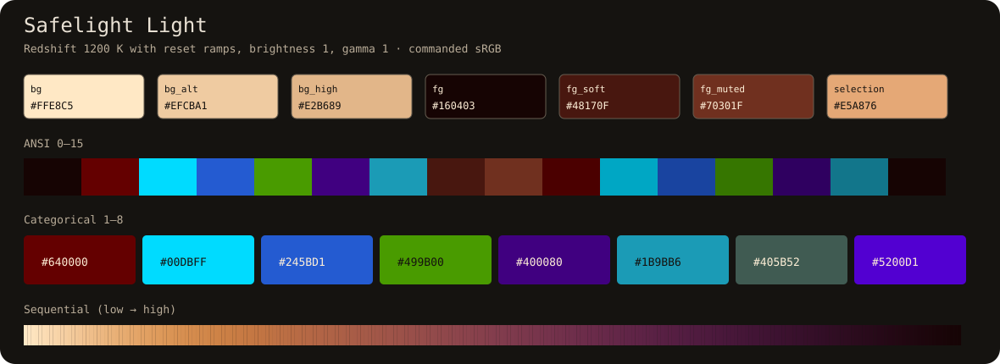
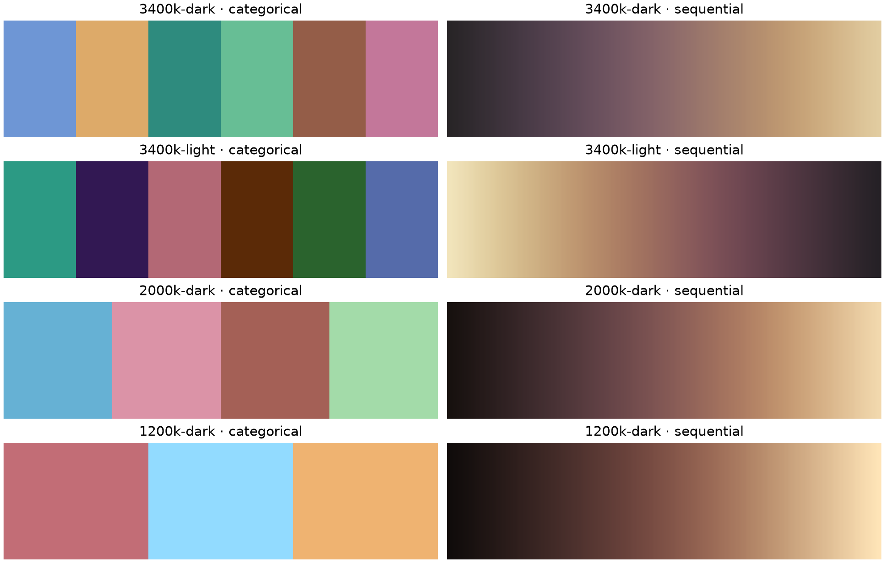

# Redshift Safe Palettes

**Six terminal, categorical, and sequential color systems engineered to remain useful after a display-wide warm/red shift.**

[](https://github.com/carpdiem/redshift-safe-palettes/actions/workflows/ci.yml)
[](LICENSE)
[](pyproject.toml)


The image above shows the **commanded sRGB colors**—the values a UI, terminal, or plot should request. They are intentionally sometimes odd in ordinary daylight. The design target is what remains *after* the named warm-display profile suppresses green and especially blue.

## The six defined schemes

| Warmth tier | Dark canvas | Light canvas | Intended target |
|---|---|---|---|
| Minimum | [**Ember Dark**](docs/swatches/ember-dark.svg) | [**Ember Light**](docs/swatches/ember-light.svg) | warmest macOS Night Shift surrogate (~3400 K) |
| Middle | [**Lowfire Dark**](docs/swatches/lowfire-dark.svg) | [**Lowfire Light**](docs/swatches/lowfire-light.svg) | deep software redshift (~2000 K) |
| Maximum | [**Safelight Dark**](docs/swatches/safelight-dark.svg) | [**Safelight Light**](docs/swatches/safelight-light.svg) | extreme deep-red stress profile (~1200 K) |

Each linked specification sheet contains:

- exact hex values for three backgrounds, three foregrounds, and a selection surface;
- exact hex values for eight categorical colors;
- swatches for ANSI 0–15 terminal colors; and
- the full 256-sample sequential map.

Every exact terminal and continuous value is in the canonical JSON manifest.

<details>
<summary><strong>Expand the exact specification sheets</strong></summary>

### Ember Dark


### Ember Light


### Lowfire Dark


### Lowfire Light


### Safelight Dark


### Safelight Light

</details>

- **Canonical machine-readable source:** [`palettes/redshift-safe-palettes.json`](palettes/redshift-safe-palettes.json)
- **CSS tokens:** [`palettes/redshift-safe-palettes.css`](palettes/redshift-safe-palettes.css)
- **Terminal imports:** [`themes/terminal/`](themes/terminal/)
- **Commanded versus simulated comparison:** [`docs/swatches/command-vs-simulated.png`](docs/swatches/command-vs-simulated.png)

---

## Use them

### Matplotlib

Install directly from GitHub:

```bash
python -m pip install "git+https://github.com/carpdiem/redshift-safe-palettes.git"
```

```python
import matplotlib.pyplot as plt
from redshift_safe import categorical, sequential

plt.scatter(x, y, c=labels, cmap=categorical("lowfire-dark"))
plt.imshow(data, cmap=sequential("lowfire-dark"))
```

Available slugs:

```text
ember-dark       ember-light
lowfire-dark     lowfire-light
safelight-dark   safelight-light
```



### CSS

Load [`redshift-safe-palettes.css`](palettes/redshift-safe-palettes.css), then select a family on any container:

```html
<section data-redshift-palette="ember-dark">
  <div class="panel">...</div>
</section>
```

```css
.panel {
  color: var(--rs-foreground);
  background: var(--rs-background);
}
.series-a { color: var(--rs-category-one); }
.heatmap-key { background: var(--rs-sequential); }
```

CSS exposes eleven representative gradient stops. JSON and Python preserve all 256 samples.

### Terminals

Ready-to-import themes are included for:

- [Alacritty](themes/terminal/alacritty/)
- [iTerm2](themes/terminal/iterm2/)
- [Windows Terminal](themes/terminal/windows-terminal/)

Each import uses the primary background and foreground. The JSON manifest exposes two alternate backgrounds and two alternate foreground levels when a display needs a quieter canvas or more separation.

---

# How this works, from five-year-old to color nerd

## The five-year-old version: warm shift is colored sunglasses

Imagine putting orange sunglasses over a box of crayons. A blue crayon does not merely become a slightly warmer blue; much of its light is blocked. Two different crayons can look almost identical through the glasses.

Most palettes—including otherwise excellent ones such as Gruvbox or Viridis—choose colors for the *unfiltered* display. Redshift Safe Palettes instead asks:

> “After the orange glasses damage these colors, which original crayons still land far apart?”

The generator therefore does not optimize the requested RGB numbers. It transforms them first, measures the damaged result, and chooses from there.

## The Feynman version: the display channel has lost dimensions

An ordinary sRGB pixel has three controllable channels: red, green, and blue. A warm-display filter approximately multiplies those channels by three unequal gains:

```text
emitted RGB ≈ commanded RGB × [red gain, green gain, blue gain]
```

The profiles in this repository are explicit engineering stress tests:

| Profile | RGB gains | Interpretation |
|---|---:|---|
| `nightshift` | `[1.00, 0.74, 0.53]` | ~3400 K warm-white surrogate |
| `redshift` | `[1.00, 0.54, 0.055]` | ~2000 K; almost all blue removed |
| `safelight` | `[1.00, 0.34, 0.015]` | deep red; only 1.5% blue leakage |

The last row is nearly a one-dimensional display. No algorithm can create eight equally bright, wildly separated hues when the hardware is effectively emitting variations of red and amber. The honest strategy is:

1. preserve as much chromatic distance as the surviving gamut permits;
2. allow a **small, controlled lightness spread** when hue alone cannot carry eight categories;
3. keep text contrast high; and
4. require labels, shapes, dashes, or position for critical meaning.

That is why Safelight is robust engineering, not magic.

## Why these are surrogates, not device calibrations

Apple documents that Night Shift makes the display warmer—“more yellow and less blue”—and that behavior on external displays depends on the display. Apple does **not** publish a universal RGB matrix or Kelvin value for the slider. Redshift/f.lux behavior also varies by OS, display, calibration, and gamma-ramp implementation.

So the repository makes the model inspectable instead of pretending to know every screen. The exact gains are versioned in JSON and code. If measured device data becomes available, a new profile can replace the surrogate and regenerate every artifact.

---

# Derivation, step by step

## 1. Start with colors the display can actually request

The categorical generator enumerates a deterministic grid inside sRGB. Every candidate is a legal command color—no imaginary out-of-gamut point survives to the final palette.

## 2. Damage every candidate on purpose

Each candidate passes through the profile’s RGB gain vector. All optimization and acceptance metrics then operate on the transformed result. The “before” color matters only as a secondary guard against two absurdly similar unshifted colors.

## 3. Measure perception, not RGB arithmetic

Transformed colors are converted to **Oklab**, where:

- `L` approximates perceived lightness;
- `a` roughly spans green ↔ red; and
- `b` roughly spans blue ↔ yellow.

Euclidean Oklab distance multiplied by 100 is used as a practical engineering separation score. It is called `delta_e_ok` in the manifest; it is **not** a standardized CIE ΔE claim.

Oklab was chosen because it is simple, D65/sRGB-native, numerically well behaved, and designed for smooth lightness, chroma, hue, and gradient operations. A full appearance model such as CAM16 would be a reasonable future calibration tier, especially with measured viewing conditions.

## 4. Choose categorical colors by farthest-point sampling

For each family:

1. keep candidates near a target transformed lightness;
2. reject candidates without enough contrast against the primary background;
3. pick a high-chroma seed; then
4. repeatedly choose the candidate farthest from everything already selected.

As the red shift becomes stronger, the allowed lightness budget expands from roughly 4–5 Oklab points to about 10. That trade is deliberate: at the Safelight tier, strict isoluminance would cause more actual category collisions.

## 5. Build sequential maps with no false brightness cliffs

Each sequential map starts from a small set of human-chosen sRGB/Oklab path anchors. The generator then:

1. interpolates a dense path in commanded Oklab;
2. applies the target redshift to every dense sample;
3. measures cumulative distance in transformed Oklab; and
4. resamples 256 colors at equal transformed-distance intervals.

The result has monotonic transformed lightness and nearly constant perceptual step size. Light families run light → dark so low values can merge quietly into a light canvas; dark families run dark → light.

This follows the core lesson behind Viridis and other perceptual maps: ordered data should be carried by monotonic lightness, and equal data steps should not create fake visual boundaries.

## 6. Map the categorical system into ANSI terminal slots

ANSI color names are semantic slots, not promises that “blue” will still appear blue after a 1200 K filter. Slots 1–6 use the first six categorical colors; normal and bright variants move toward the family foreground in Oklab. Black/white slots come from the family surfaces.

At strong shifts, syntax color should be a fast cue—not the only cue. Good terminal grammars still use punctuation, indentation, weight, and text content.

---

# What the tests enforce

Current generated metrics:

| Family | Min shifted category ΔE<sub>OK</sub> | Shifted category L range | ΔE<sub>OK</sub> at 12% brightness | Sequential step CV | Min primary-text contrast |
|---|---:|---:|---:|---:|---:|
| Ember Dark | 9.24 | 0.0372 | 4.56 | 0.0440 | 8.41:1 |
| Ember Light | 9.45 | 0.0450 | 4.66 | 0.0400 | 7.12:1 |
| Lowfire Dark | 5.75 | 0.0681 | 2.84 | 0.0544 | 7.01:1 |
| Lowfire Light | 4.70 | 0.0760 | 2.32 | 0.0578 | 5.34:1 |
| Safelight Dark | 4.15 | 0.1033 | 2.05 | 0.0407 | 5.81:1 |
| Safelight Light | 5.83 | 0.1040 | 2.88 | 0.0438 | 4.52:1 |

The test suite rejects a generated release unless:

- all six families contain 16 ANSI, 8 categorical, and 256 sequential colors;
- categorical colors meet profile-specific transformed separation floors;
- transformed categorical lightness stays inside the declared budget;
- sequential lightness is strictly monotonic;
- sequential transformed-step coefficient of variation is ≤ 0.08;
- primary text remains at least 4.5:1 against all three family backgrounds after the target transform;
- every non-background ANSI slot remains at least 3:1 against the primary background, and light-mode ANSI black remains at least 4.5:1;
- 35% and 12% linear-light dimming preserve ordering and degrade separation smoothly; and
- JSON, CSS, Alacritty, iTerm2, Windows Terminal, Matplotlib, and rendered swatch artifacts agree with the generator.

Run the gates locally:

```bash
uv run --extra dev python tools/build_all.py --check
uv run --extra dev pytest -q
uv build
```

---

# Display brightness and astronomy safety

Turning down display brightness scales emitted linear-light energy. In an ideal black room it does not change the RGB ratios, but it **does** compress perceptual distances because fewer photons reach the eye. The generator therefore reports category separation at 35% and 12% linear-light output rather than assuming the full-brightness result holds.

Three practical rules follow:

1. **Start dim, then add only enough luminance to read.** Bright red light can still damage dark adaptation.
2. **Do not encode critical state with color alone.** Use labels, markers, patterns, line styles, or spatial grouping.
3. **Treat Safelight as a palette stress profile, not certified astronomy equipment.** Actual dark-adaptation safety depends on the display’s spectral power distribution, absolute luminance, black leakage, ambient light, viewing time, and the observer.

For serious field astronomy, a measured dim display plus a physical deep-red filter remains more trustworthy than a software palette alone.

---

# Limits and non-claims

- **Not a macOS emulator.** The 3400 K profile is a documented approximation because Apple does not publish a universal maximum-Night-Shift transform.
- **Not a spectroradiometric model.** RGB gains cannot capture a display’s actual primaries, backlight spectrum, OLED leakage, ICC profile, True Tone, or gamma-ramp details.
- **Not a medical or sleep claim.** “Warmer” does not automatically mean safer or better for sleep.
- **Not color-vision-deficiency certification.** Redshift and CVD are different transforms. Critical interfaces must test both and retain redundant encoding.
- **Not isoluminant at the extreme tier.** Safelight uses up to about 0.104 Oklab lightness range across eight categories because the transformed hue gamut is too narrow for strict equal-lightness separation.
- **Not universally optimal.** A palette is a system component; font weight, line width, area, surrounding colors, ambient light, and data density still matter.

---

# Repository map

```text
palettes/                         canonical JSON + CSS exports
src/redshift_safe/               color math, definitions, generator, Matplotlib API
themes/terminal/                 Alacritty, iTerm2, Windows Terminal imports
docs/swatches/                   exact SVG specs and transform comparisons
examples/                         executable Matplotlib gallery
tests/                            numerical and export contracts
tools/build_all.py               deterministic artifact builder
```

Generated artifacts should not be hand-edited. Change [`definitions.py`](src/redshift_safe/definitions.py) or the generator, rebuild, inspect, and rerun the gates.

---

# Sources and intellectual lineage

- Apple, [Use Night Shift on your Mac](https://support.apple.com/en-us/102191) — behavior and display-dependence; no universal transform published.
- Matplotlib, [Choosing Colormaps](https://matplotlib.org/stable/users/explain/colors/colormaps.html) — monotonic lightness and perceptually uniform sequential maps.
- Smith & van der Walt, [A Better Default Colormap / Viridis design](https://bids.github.io/colormap/) — equal perceptual steps, gamut awareness, and transform-based evaluation.
- Björn Ottosson, [A perceptual color space for image processing](https://bottosson.github.io/posts/oklab/) — Oklab definition and matrices.
- HoloViz Colorcet, [Collection of perceptually accurate colormaps](https://colorcet.holoviz.org/) — Kovesi-style continuous maps and Glasbey-style categorical separation.
- CIE, [CIECAM16](https://cie.co.at/publications/cie-2016-colour-appearance-model-colour-management-systems-ciecam16) — viewing-condition-aware color appearance as the more complete scientific frame.
- Tanner Helland, [Temperature to RGB approximation](https://tannerhelland.com/2012/09/18/convert-temperature-rgb-algorithm-code.html) — useful engineering intuition and explicit warnings against scientific overclaiming.
- W3C WAI, [Understanding WCAG contrast minimum](https://www.w3.org/WAI/WCAG21/Understanding/contrast-minimum.html) — 4.5:1 text and 3:1 large-text thresholds.
- U.S. National Park Service, [Dark adaptation and red flashlights](https://www.nps.gov/articles/dark-adaptation-of-the-human-eye-and-the-value-of-red-flashlights.htm) — dim red light is preferable; bright red light can still reduce dark adaptation.

## License

MIT © 2026 Michael Woods.
