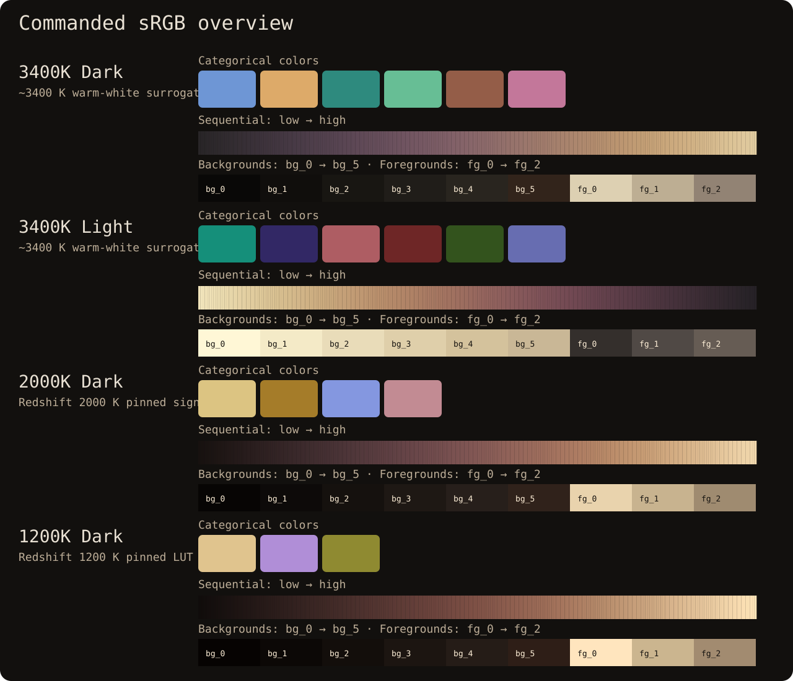
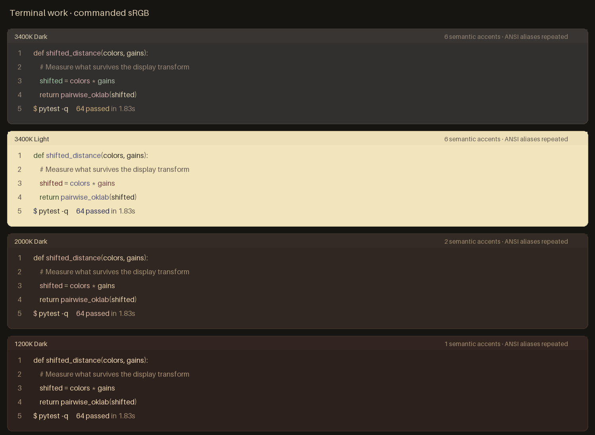
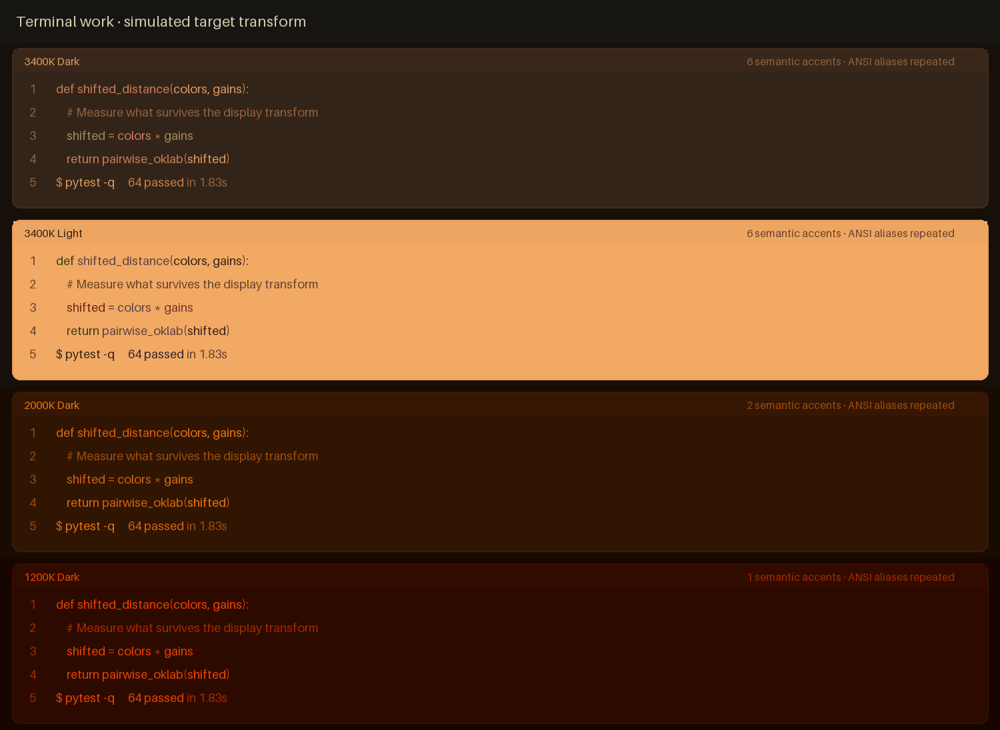
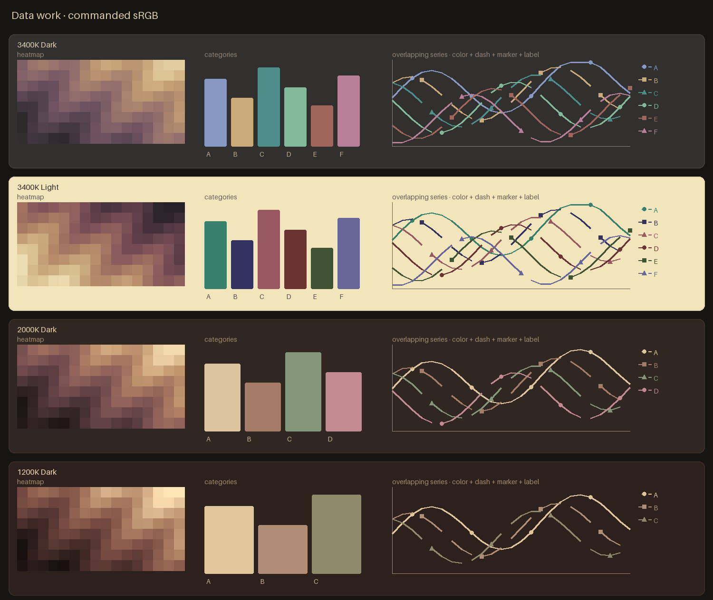
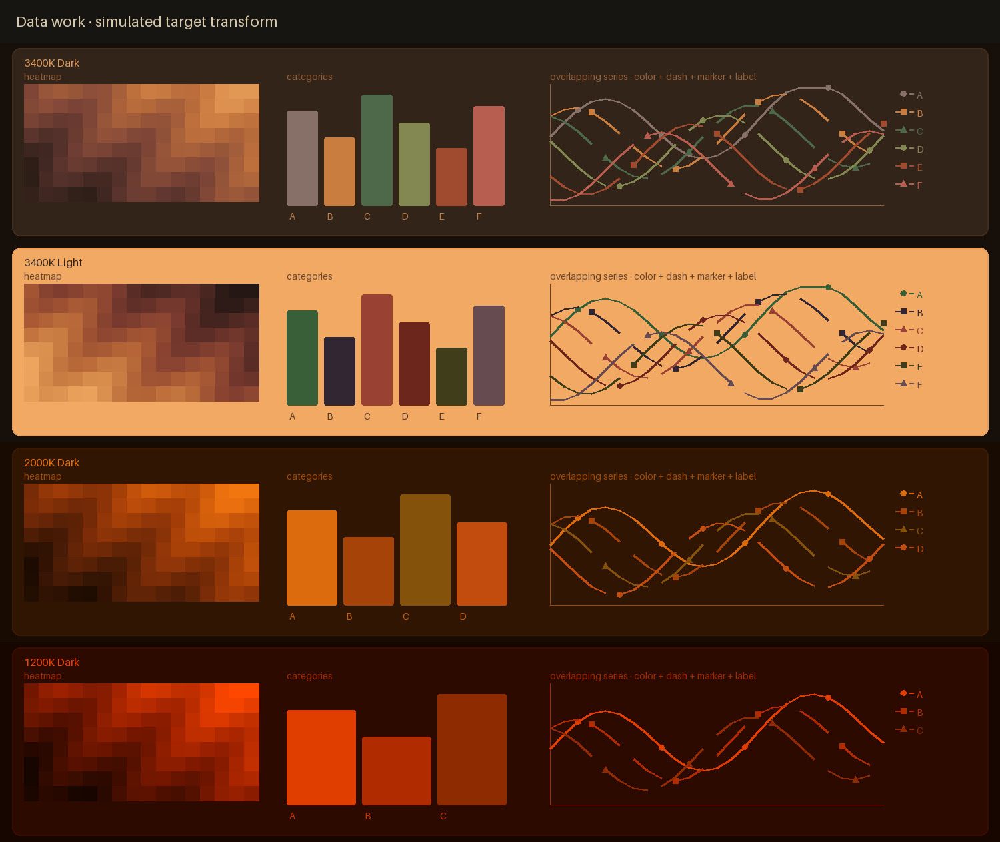
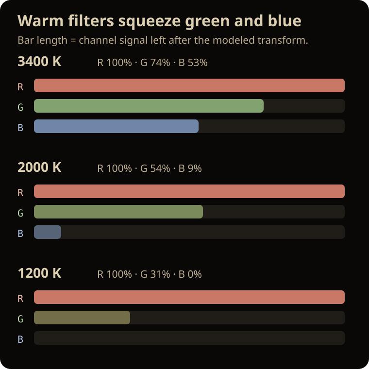
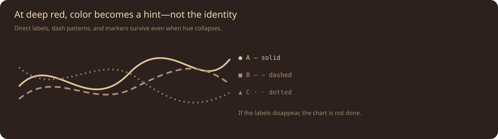

# Ember: Redshift Safe Color Palettes

**Calm terminal and data-visualization palettes designed for displays under strong warm/red transforms.**

[](https://github.com/carpdiem/ember-redshift-safe-palettes/actions/workflows/ci.yml)
[](LICENSE)
[](pyproject.toml)



Ember is deliberately **not** a maximum-separation rainbow. It uses warm neutrals,
moderate text contrast, low commanded chroma, and progressively fewer colors as the
display transform destroys the usable gamut.

## The four palettes

| Palette | Mode | Categories | Terminal accents | Design target |
|---|---|---:|---:|---|
| [`3400k-dark`](docs/swatches/3400k-dark.svg) | dark | 6 | 6 | warmest macOS Night Shift surrogate |
| [`3400k-light`](docs/swatches/3400k-light.svg) | light | 6 | 6 | warmest macOS Night Shift surrogate |
| [`2000k-dark`](docs/swatches/2000k-dark.svg) | dark | 4 | 2 | pinned Redshift 2000 K signal LUT |
| [`1200k-dark`](docs/swatches/1200k-dark.svg) | dark | 3 | 1 | pinned Redshift 1200 K signal LUT |

There are no 2000 K or 1200 K light palettes. Screenshot QA showed the mechanism
clearly: because red remains at full gain, a light canvas becomes a large, saturated
orange/red emitter after those transforms. That is hostile for the intended nighttime
use. Ember deletes the unsafe option instead of pretending every tier deserves a
symmetric feature matrix.

Terminal file formats still require 16 ANSI slots. At 2000 K and 1200 K those slots
intentionally alias the same two or one semantic accents. **Protocol slots are not a
license to invent colors the transformed display cannot support.**

## See the actual screens, not just swatches

“Commanded” is the raw sRGB an application requests. “Simulated” applies the named
RGB gain profile to every pixel, approximating what the same screen looks like when
the relevant warm transform is active.

### Terminal work at small code size

| Commanded sRGB / no warm transform | Simulated target transform |
|---|---|
|  |  |

### Data work: heatmaps, bars, and overlapping lines

| Commanded sRGB / no warm transform | Simulated target transform |
|---|---|
|  |  |

The overlapping lines deliberately combine **color + dash + marker + text label**.
At 1200 K, blue is zero. No clever palette can make hue carry information through a
channel that no longer exists.

- [Generated screenshot diagnostics](docs/sample-analysis.md)
- [Compact commanded-versus-simulated swatches](docs/swatches/command-vs-simulated.png)
- [Canonical machine-readable manifest](palettes/redshift-safe-palettes.json)
- [CSS tokens](palettes/redshift-safe-palettes.css)
- [Terminal imports](themes/terminal/)

---

## Use Ember

### Matplotlib

```bash
python -m pip install "git+https://github.com/carpdiem/ember-redshift-safe-palettes.git"
```

```python
import matplotlib.pyplot as plt
from redshift_safe import categorical, categorical_norm, encode_categories, sequential

palette = "2000k-dark"
category_order = ["control", "alpha", "beta", "gamma"]
category_ids = encode_categories(labels, category_order, slug=palette)

plt.scatter(
    x,
    y,
    c=category_ids,
    cmap=categorical(palette),
    norm=categorical_norm(palette),
)
plt.imshow(data, cmap=sequential(palette))
```

Pass the slug to `categorical_norm()` and `encode_categories()` so their category
limits match the selected palette. The defaults match the largest current family,
`3400k-dark`.

Every sequential map still provides 256 canonical float samples for Matplotlib and
other numerical consumers. Fewer **categories** do not mean a banded **continuous**
map.

### CSS

Load [`redshift-safe-palettes.css`](palettes/redshift-safe-palettes.css), then select
a family:

```html
<section data-redshift-palette="3400k-dark">
  <div class="panel">...</div>
</section>
```

```css
.panel {
  color: var(--rs-foreground);
  background: var(--rs-background);
}
.series-a { color: var(--rs-category-one); }
.heatmap-key { background: var(--rs-sequential); }
```

CSS exposes eleven representative 8-bit gradient stops. JSON and Python preserve
all 256 canonical float samples.

### Terminals

Ready-to-import themes are included for:

- [Alacritty](themes/terminal/alacritty/)
- [iTerm2](themes/terminal/iterm2/)
- [Windows Terminal](themes/terminal/windows-terminal/)

`foreground` is the transformed small-text role. `foreground_soft` and
`foreground_muted` are quieter hierarchy roles, not universal body-text colors.
Inspect every exact pairing in `metrics.shifted_text_contrast` in the manifest.

---

# How this works, from five-year-old to color nerd

## The five-year-old version: colored sunglasses

Imagine orange sunglasses over a box of crayons. Blue does not become “slightly
warmer”; most of its light is blocked. Different crayons can become the same brown.

Ember asks:

> After the glasses damage these colors, what remains readable—and how many colors
> are still honestly useful?

The answer is six at the mild tier, four data colors at 2000 K, and three at 1200 K.
For tiny terminal text, the honest answer collapses faster: six, two, then one.

## The Feynman version: the channel loses dimensions

An sRGB pixel begins with three controls. The modeled display transform multiplies
them by unequal gains:

```text
emitted RGB ≈ commanded RGB × [red gain, green gain, blue gain]
```



| Profile | RGB gains | Interpretation |
|---|---:|---|
| `3400k` | `[1.00, 0.74, 0.53]` | warm-white Night Shift surrogate |
| `2000k` | `[1.0000, 0.5436, 0.0868]` | Redshift 2000 K, reset ramps, brightness 1, gamma 1 |
| `1200k` | `[1.0000, 0.3094, 0.0000]` | Redshift 1200 K, reset ramps, brightness 1, gamma 1 |

At 1200 K, blue contributes nothing and green is heavily attenuated. The remaining
signal is effectively a red-versus-dim-red axis. Identity therefore needs another
channel—shape, pattern, position, text, or weight.



## Why the old “maximize separation” objective failed

The first generator seeded categorical selection with the **maximum-chroma** legal
color, rewarded additional chroma, and optimized farthest-point distance. It passed
its mathematical gates and produced painful, candy-bright dark themes. That was not
a tuning error. It was the predictable result of the wrong objective function.

Ember now makes comfort and composition authored constraints:

1. category colors are human-composed, low-chroma sets rather than optimizer output;
2. warm gray/brown surfaces carry most pixels;
3. terminal accents are lifted only until transformed small-text contrast reaches
   roughly 4.5:1;
4. ANSI “bright” colors repeat the calm semantic accents instead of creating a
   second rainbow; and
5. category and terminal counts decrease with the surviving gamut.

### Before/after audit of the rejected dark palettes

| Target | Categories | Max categorical chroma | Max terminal chroma | Raw body contrast | Shifted body contrast |
|---|---:|---:|---:|---:|---:|
| 3400 K, rejected → Ember | 8 → 6 | 0.3225 → 0.0786 | 0.3225 → 0.0755 | 15.15 → 8.59 | 9.91 → 6.34 |
| 2000 K, rejected → Ember | 8 → 4 | 0.3034 → 0.0677 | 0.3034 → 0.0563 | 17.06 → 10.00 | 7.99 → 5.59 |
| 1200 K, rejected → Ember | 8 → 3 | 0.2753 → 0.0640 | 0.2753 → 0.0591 | 17.12 → 11.45 | 6.05 → 4.85 |

This is not cosmetic dimming. The new commanded categorical chroma ceiling is below
one quarter of the rejected maximum at every dark tier, and primary text no longer
targets near-white-on-near-black contrast.

## What the visual literature changes in practice

- **Small detail rides luminance, not hue alone.** Human chromatic channels have
  poorer spatial resolution than luminance. Saturated opposing hues on tiny glyphs
  can shimmer or fuzz; red/blue adjacency is especially vulnerable to chromatic
  aberration. Ember avoids such pairings and uses redundant structure.
- **More contrast is not always more comfort.** Minimum contrast protects
  legibility; unlimited white-on-black contrast can create glare/halation for some
  readers. Ember uses off-black warm surfaces and cream rather than pure white.
- **Color should be sparse.** MIT's interface guidance recommends few, weakly
  saturated colors; Datawrapper and the EU data-visualization guide likewise advise
  against too many categories and overly bright/saturated hues.
- **Gray is active design material.** Warm neutrals establish hierarchy so accents
  do not all shout at once.
- **Dark mode is not universally superior.** Polarity research is mixed and depends
  on task, ambient light, and observer. Ember keeps a 3400 K light option. It rejects
  deep-shift light canvases because the rendered evidence is bad, not because “dark
  mode always wins.”

Gruvbox is the aesthetic benchmark: its stated goal is distinguishable, sufficient-
contrast colors that remain pleasant to the eyes, built on warm grays and restrained
“retro groove” accents. Ember does not copy Gruvbox values; it adopts that hierarchy
and then evaluates the result after each destructive transform.

---

# Derivation and measurable gates

## Categorical colors

The category sets are authored in sRGB, serialized to Hex8, reparsed, transformed,
and measured in Oklab. Published `delta_e_ok` is Euclidean Oklab distance × 100, a
practical engineering score—not a standardized CIE ΔE claim.

Current gates and results:

| Family | Categories | Max raw Oklab chroma | Min shifted category ΔEOK | Shifted L range |
|---|---:|---:|---:|---:|
| 3400K Dark | 6 | 0.0786 | 7.31 | 0.1700 |
| 3400K Light | 6 | 0.0846 | 10.04 | 0.2026 |
| 2000K Dark | 4 | 0.0677 | 6.25 | 0.1659 |
| 1200K Dark | 3 | 0.0640 | 6.95 | 0.1616 |

The wider lightness range is deliberate. At severe shifts, equal-lightness hues
collapse. Lines and small marks must also use patterns and labels so lightness does
not silently imply a false ordering.

## Terminal colors

Each categorical accent is blended toward the family foreground only until its
transformed contrast reaches the small-text floor. The 16 ANSI slots then alias the
small surviving set. Transformed terminal small-text roles measure at 4.55–4.57:1;
body foregrounds range from 4.85:1 to 7.64:1 against the primary backgrounds.

## Sequential maps

Each 256-sample map begins with a restrained, human-chosen earth-tone path. The
generator smooths it in Oklab, applies the target transform, measures cumulative
transformed distance, and resamples at equal transformed-distance intervals.

The canonical `continuous_rgb` arrays remain strictly monotonic in transformed
lightness and nearly constant in transformed perceptual step. `continuous_hex8` is
the convenient quantized preview; the float map carries the strict guarantee.

## Screenshot analysis

The build renders actual code, heatmaps, bars, and overlapping lines from the final
manifest. It then measures high-contrast luminance-edge density and pixel chroma.
The release also receives a manual visual audit at full resolution.

See [`docs/sample-analysis.md`](docs/sample-analysis.md) for the generated report.
The transformed screenshots naturally become chromatic when the transform removes
green/blue; that is a property of the modeled filter. The meaningful comfort signals
are that commanded high-chroma area is zero at the report threshold, transformed
high-contrast edge density decreases, and information survives through redundant
encodings rather than a compensating neon rainbow.

---

# MacBook Pro display target

The practical display target is the built-in MacBook Pro Liquid Retina XDR panel.
Apple documents wide-color P3, 1 billion colors, and a 254 ppi panel on current
14-inch models, with a P3-based general-use reference mode. Ember still exports sRGB
because terminals, CSS, Matplotlib, and interchange formats need portable values;
macOS color management maps those values to the panel.

The model does **not** attempt to emulate mini-LED local dimming, viewing angle,
True Tone, ambient adaptation, panel brightness, or spectral output. Samples should
be judged in SDR at a sane nighttime brightness. XDR peak-nit specifications are not
a target.

Apple does not publish a universal Night Shift matrix or Kelvin value. The 3400 K
profile is therefore an explicit surrogate. The Redshift 2000 K and 1200 K profiles
come from pinned signal-LUT rows, but physical output still varies with calibration,
OS gamma-ramp precision, and display behavior.

---

# Verification

The suite rejects a release unless:

- exactly the intended four families exist with category counts `6, 6, 4, 3`;
- terminal semantic counts are `6, 6, 2, 1` while all required ANSI slots parse;
- commanded categorical Oklab chroma is ≤ 0.09;
- categorical transformed separation meets the profile floor;
- transformed terminal small-text roles are ≥ 4.5:1;
- primary text is ≥ 4.5:1 on all declared backgrounds and selections;
- 256 float sequential samples remain unique, monotonic, and nearly even after the
  target transform; and
- JSON, CSS, terminal imports, screenshots, diagrams, and diagnostics reproduce
  exactly from source.

```bash
uv run --extra dev python tools/build_all.py --check
uv run --extra dev pytest -q
uv build
```

---

# Limits and non-claims

- **Not a device calibration.** RGB gains are inspectable stress profiles, not
  spectroradiometric measurements.
- **Not a medical or sleep claim.** Warmer does not automatically mean safer,
  healthier, or less fatiguing.
- **Not color-vision-deficiency certification.** Redshift and CVD are different
  transforms; critical graphics still need redundant encoding.
- **Not astronomy certification.** Absolute luminance, black leakage, spectrum,
  ambient light, adaptation state, and viewing time all matter.
- **Not a promise that hue survives 1200 K.** It does not. Ember says so and reduces
  the available semantic set.
- **Not proof from image metrics alone.** Screenshot metrics catch regressions; they
  do not measure a human observer's discomfort.

For serious field astronomy, a measured dim display plus a physical deep-red filter
remains more trustworthy than software alone.

---

# Repository map

```text
palettes/                         canonical float JSON + quantized CSS exports
src/redshift_safe/               color math, definitions, generator, Matplotlib API
themes/terminal/                 Alacritty, iTerm2, Windows Terminal imports
docs/samples/                    commanded and simulated real-work screens
docs/diagrams/                   Feynman-level visual explanations
docs/swatches/                   exact specifications and compact comparisons
examples/                        executable Matplotlib gallery
tests/                           numerical, comfort, and export contracts
tools/build_all.py               deterministic artifact builder
tools/render_samples.py          screenshot renderer and image diagnostics
```

Generated artifacts should not be hand-edited. Change
[`definitions.py`](src/redshift_safe/definitions.py), rebuild, inspect the screenshots
at full size, and rerun the gates.

---

# Sources and design lineage

- Gruvbox, [original project and palette](https://github.com/morhetz/gruvbox) — warm
  neutrals, sufficient contrast, and pleasant sustained use as explicit goals.
- MIT 6.813, [Color](https://web.mit.edu/6.813/www/sp18/classes/15-color/) — chromatic
  aberration, poor blue spatial resolution, sparse color, and weak saturation.
- Fan et al. (2024), [The Effect of Ambient Illumination and Text Color on Visual
  Fatigue under Negative Polarity](https://doi.org/10.3390/s24113516) — controlled
  low-light negative-polarity study; red text produced the most fatigue in its tested
  conditions, reinforcing the need not to add gratuitous chroma under a red transform.
- EU Data Visualisation Guide, [Colour for categories](https://data.europa.eu/apps/data-visualisation-guide/colour-for-categories)
  — avoid too many, overly saturated, or very bright categories; test CVD.
- Datawrapper, [What to consider when choosing colors](https://www.datawrapper.de/academy/what-to-consider-when-choosing-colors-for-data-visualization)
  — use gray, limit categories, preserve small-text contrast, and add redundancy.
- Apple, [Use presets and reference modes with your Apple display](https://support.apple.com/en-us/108321)
  and [MacBook Pro display specifications](https://support.apple.com/en-us/125405) —
  P3 general-use/reference modes, panel density, and XDR context.
- Apple, [Use Night Shift on your Mac](https://support.apple.com/en-us/102191) —
  documented behavior and display dependence; no universal transform published.
- Redshift, [pinned color-ramp implementation](https://github.com/jonls/redshift/blob/490ba2aae9cfee097a88b6e2be98aeb1ce990050/src/colorramp.c)
  and [temperature table](https://github.com/jonls/redshift/blob/490ba2aae9cfee097a88b6e2be98aeb1ce990050/README-colorramp).
- Björn Ottosson, [A perceptual color space for image processing](https://bottosson.github.io/posts/oklab/).
- Matplotlib, [Choosing Colormaps](https://matplotlib.org/stable/users/explain/colors/colormaps.html).
- W3C WAI, [Understanding contrast minimum](https://www.w3.org/WAI/WCAG21/Understanding/contrast-minimum.html).

## License

MIT © 2026 Michael Woods.