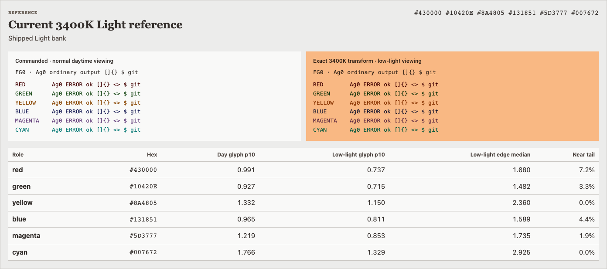
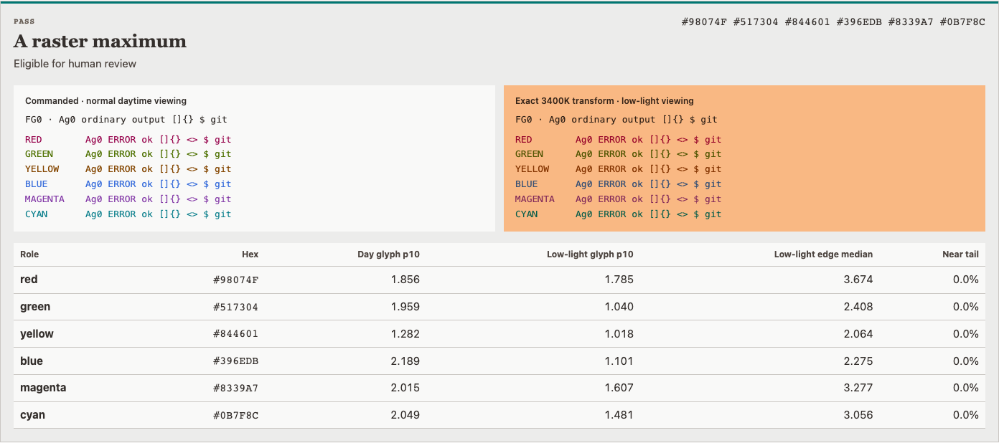
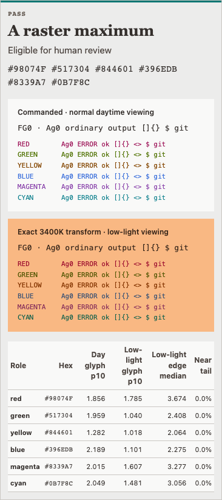

# 3400K Light terminal accent raster experiment

## Status

**Experimental. Production is unchanged. Human selection is required.**

This rebuild targets the six authored ANSI accents only:

`red, green, yellow, blue, magenta, cyan`

Frozen from canonical Ember commit `016c6b37b283baf44711af3330d2872305b9398c`:

- all 3400K Light surfaces and `fg_0…fg_2`;
- 3400K gains `(1.0, 0.74, 0.53)`;
- ANSI aliases/groups;
- categorical and sequential banks;
- every unrelated family.

## Viewing conditions

The search deliberately does **not** use one viewing condition for both states.

| State | CAM16 viewing model |
|---|---|
| Commanded/daytime | normal light: `L_A=64`, `Y_b=20`, 0.75% flare |
| 3400K transformed | low light: `L_A=8`, `Y_b=3`, 0.75% flare |
| ±5% gain samples | low light: `L_A=8`, `Y_b=3`, 0.75% flare |

These are explicit engineering scenarios, not device calibrations.

## Search contract

- exact Hex8 quantize/reparse before scoring;
- commanded semantic Oklab hue corridors;
- WCAG ≥4.5 on the actual terminal canvas `bg_0` in commanded, nominal transformed, and sampled gain states;
- exact per-role foreground clearance;
- commanded Oklab pair floor retained;
- transformed distinctness is governed primarily by low-light CAM16 and browser glyph evidence; transformed Oklab is a secondary 7.5 floor rather than the stale 11.0 release gate;
- brightness/colorfulness are optimized upward subject to contrast rather than rewarding arbitrarily black ink;
- gain corners are sampled diagnostics, not a continuous-box proof.

## Browser evidence

Chromium renders Menlo terminal glyphs at:

- 11/13/15 px;
- 400/600 weight;
- DPR 1/2;
- `bg_0` and report-only `bg_1`;
- phases `0` or `0.5/DPR` CSS px on each axis;
- commanded, nominal transformed, and four gain-corner states.

The nominal human-review gate requires:

- red/green/blue active-pixel p10 to strictly improve versus current Light;
- all other roles to retain at least 85% of current p10;
- zero accent→`fg_0` near-tail samples (`ΔEOK < 0.5`);
- zero exact RGB8 collisions;
- nonregressive worst accent-pair p10.

Gain-corner browser results are reported diagnostics. Analytical contrast and pair gates at those samples are hard.

## Result

Only **A-raster-maximum** passes the declared nominal browser gate:

```text
red      #98074F
green    #517304
yellow   #844601
blue     #396EDB
magenta  #8339A7
cyan     #0B7F8C
```

B and C remain in the review package as rejected diagnostics. They are not selectable finalists.

## Reproduce

```bash
python docs/experiments/3400k-light-terminal-raster/search.py
python docs/experiments/3400k-light-terminal-raster/browser_evidence.py
python docs/experiments/3400k-light-terminal-raster/render_review.py
pytest -q tests/test_3400k_light_terminal_raster_experiment.py
```

The browser step needs GStack Chromium. The search/test environment needs the `dev` and `experiment` extras.

The captured runtime (`macOS arm64`, `Python 3.11`, `colour-science 0.4.7`, `NumPy 2.4.6`)
must reproduce the recorded payload exactly. Other supported runtimes must preserve
the exact structural/identity contract and every Candidate ID/Hex/order/count while
keeping all computed numeric drift within `1e-9`; the recorded payload hash remains
an exact integrity check over the captured bytes.

## Review

Open `review/index.html` for the complete interactive review.

### Current Light reference



### Eligible A — raster maximum



### Eligible A — phone width



The PNGs are immutable review captures of the generated page. The HTML page contains the
full current/A/B/C/Dark comparison and metric tables.

`review/selection.json` intentionally records:

```json
{
  "selection": null,
  "automatic_recommendation": null,
  "production_promotion": false
}
```

Do not modify canonical definitions or regenerate production exports until Michael explicitly selects a candidate.
