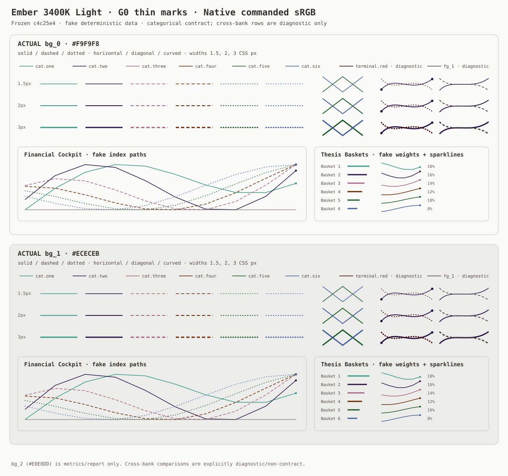
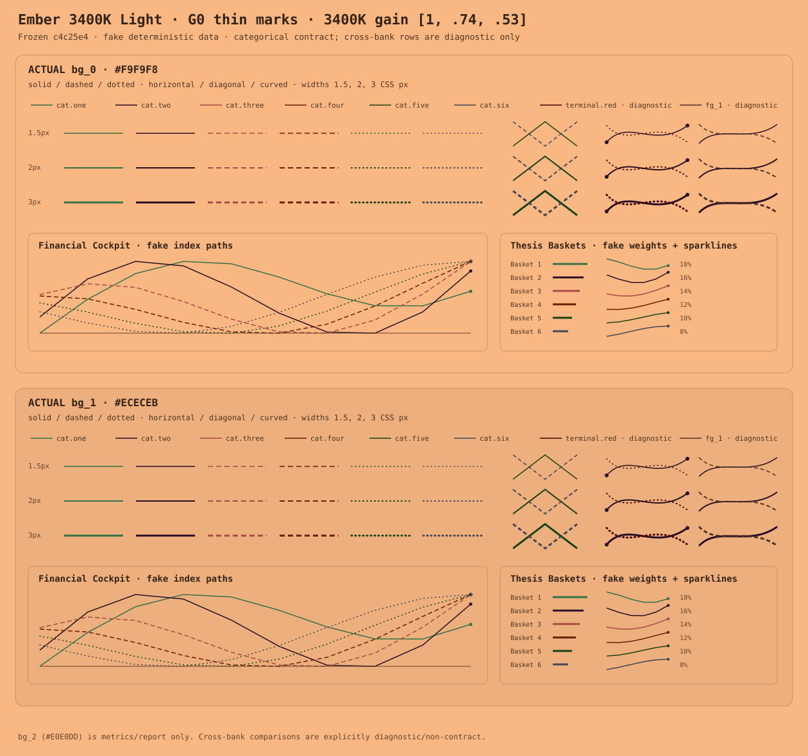

# Stop Gate G0: current 3400K Light thin-mark evidence

**Verdict: READY for human G0 review; not ready for candidate optimization until the visible failure is accepted as reproduced.**

This is an isolated Phase 0/1 evidence harness frozen to `c4c25e480912f8f54cbd8c992c0b6eb520dc0b8f`. It changes no production palette or export. The [review index](review/index.html) uses deterministic fake Financial Cockpit and Thesis Baskets-style data and local SVG geometry only.

## Reproduced current failures

The transformed 1.5 CSS px diagonal at DPR 1 on actual `bg_0` is the named numerical case. The provisional 8 ΔE_OK edge-coverage floor is a **diagnostic**, not a calibrated threshold.

| Scope | Comparison | encoded-sRGB coverage proxy ΔE_OK | diagnostic floor | Result |
|---|---|---:|---:|:---:|
| categorical-contract | cat.five vs cat.six | 6.3280 | 8.0 | **FAIL** |
| diagnostic-non-contract | cat.two vs terminal.red | 3.4206 | 8.0 | **FAIL** |
| diagnostic-non-contract | cat.two vs fg_1 | 7.1214 | 8.0 | **FAIL** |

The categorical failure is the contract finding. Both cross-bank rows are deliberately labeled **diagnostic/non-contract** and cannot veto a categorical bank on their own. Human-visible evidence is in short legends, crossings, endpoints, and sparklines in `review/transformed.svg`; compare directly with `review/commanded.svg`.

At native DPR 1, cat.five/cat.six lose reliable identity in the dedicated solid crossings, where both traces reference one shared geometry at equal width and color is the only style identity channel. Separately, the paired fake Financial Cockpit paths use the same dotted stroke treatment and equal width. The cat.two/terminal.red diagnostic pair becomes the clearest dark-mark collision; cat.two/fg_1 also becomes harder to track in the compact curved and sparkline geometry. These are review observations, not substitutes for a calibrated threshold.

### Native commanded

### 3400K transformed

## Solid commanded identity

Solid commanded Oklab minimum: `cat.three vs cat.six` = **16.6381 ΔE_OK**. This confirms the defect is not a failure of the existing solid commanded bank gate.

## Transform/compositing check

For 30,528 diagonal-model samples, `transform(blend())` and `blend(transform())` differ by at most `0.000e+00` encoded-sRGB channel units. This validates operation order only for the unclipped encoded-sRGB coverage proxy.

## Proxy vs real Chromium raster

Overall **PASS**. Global pooled acceptance: **PASS**; Oklab-distance correlation 0.9685 (floor 0.95), mean absolute error 0.4223 ΔE_OK (ceiling 0.75), and pooled 95th-percentile error 0.7319.

Pair/background MAE acceptance: **PASS**; every DPR × background × named-pair row is gated at MAE ≤ 0.75 ΔE_OK; worst observed MAE is 0.5864. Pair/background correlations are disclosed diagnostics, not a local 0.95 gate; the minimum is 0.9408. The contract pair at DPR 2 is: bg_0 r=0.9410, MAE=0.4540; bg_1 r=0.9408, MAE=0.4555.

No full-image hash is a metric. The browser check compares sampled line pixels and per-pixel pair distances. Its JSON provenance hashes the exact browser probe, validator source, and GStack browse binary, and records sanitized browser status/mode. Chromium version is unavailable and is not claimed. The check skips cleanly when the project-supported GStack browser binary is unavailable.

## Metric boundary and unresolved calibration

- Commanded solid identity: Euclidean Oklab, as requested.
- Coverage: simple encoded-sRGB area blend, explicitly diagnostic.
- Transformed metric backend: injectable callable; current backend is `oklab-diagnostic`.
- Final light-mode transformed metric: **unset**. The dark CAM16-UCS conditions (`L_A=8`, `Y_b=3`) are not silently reused.
- Open questions: light viewing conditions/flare; a justified thin-mark discrimination floor; and a line-level aggregation rule for raster coverage.

## G0 decision

The G0 package is genuinely ready **for the human stop-gate decision**: the baseline, specimens, rederived diagnostics, algebra check, and browser error bounds are present and reproducible. G0 has not been declared passed; that requires a human reviewer to accept the current cat.five/cat.six loss of reliable identity and to keep the cross-bank cases diagnostic only. G0 does not authorize color search, optimization, or production changes.
