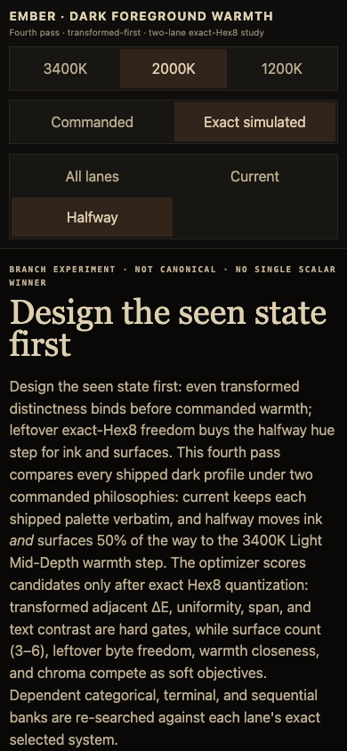

# Dark foreground warmth exploration

> **Branch:** `exp/dark-foreground-warmth`<br>
> **Status:** isolated experiment; not a production palette update<br>
> **Live comparison:** [open `index.html`](index.html)

## Bottom line

Design the seen state first: even transformed distinctness binds before commanded warmth; leftover exact-Hex8 freedom buys the halfway hue step for ink and surfaces.

This dependent-bank pass freeze-locks the already approved current and halfway backgrounds/foregrounds, then redesigns only categorical, terminal, and sequential banks. Transformed perceptual metrics use flare-aware CAM16-UCS (`L_A=8`, `Y_b=3`, flare `0.0075` of untransformed white); commanded identity remains in Oklab and WCAG contrast remains an independent hard gate.

## Methodology

- **Transformed-first gating.** Even the *transformed* (warm-display simulated) appearance must keep distinct surfaces and readable text before any commanded-warmth objective is scored. This is the pass's central discipline: the seen state is designed first.
- **Variable surface count.** The halfway lane searches background counts 3–6 per profile; each count gets a bounded exact-Hex8 search with deterministic seeds. Leftover byte freedom inside the ±24-byte radius is what buys the hue step.
- **Independent dependent banks.** Categorical count trials are validated only by categorical gates; terminal and sequential gates cannot veto them. The complete selected assembly receives one final combined validation.
- **Sampled gain evidence.** Final candidates receive a unique 3×3 grid over nonzero gain axes (blue-zero duplicates are removed). These are sampled-grid diagnostics, not continuous worst-case claims; near-floor candidates receive a denser adaptive scan.
- **Constructed scalar ramps.** The approved commanded path is densely sampled and resampled by transformed CAM16-UCS arc length, blended only when required to keep commanded CV ≤ 0.18. The 256 float samples are canonical; six Hex8 anchors are previews.
- **Recomputed evidence.** The renderer recomputes every published metric and both badge families from the serialized Hex8 values; no upstream release-status field exists in this schema to trust.

## Chosen surface counts

| Profile | Current bg_count | Halfway bg_count | Halfway choice rule / note |
|---|:---:|:---:|---|
| 3400K Dark | 6 | 5 | shared dark anchor; floating warm light anchor; interiors refined to even CAM16-UCS steps >=3.84 |
| 2000K Dark | 6 | 4 | shared dark anchor; shared light anchor; interiors refined to even CAM16-UCS steps >=3.84 |
| 1200K Dark | 6 | 4 | shared dark anchor; shared light anchor; interiors refined to even CAM16-UCS steps >=3.84 |

## Categorical adoption notes

- **3400K Dark · Current:** shipped count retained after categorical-only validation; shipped count is 6 colors.
- **3400K Dark · Halfway:** shipped count retained after categorical-only validation; shipped count is 6 colors.
- **2000K Dark · Current:** shipped count retained after categorical-only validation; shipped count is 4 colors.
- **2000K Dark · Halfway:** shipped count retained after categorical-only validation; shipped count is 4 colors.
- **1200K Dark · Current:** optimized shipped-count trial infeasible; shipped bank retained; shipped count is 3 colors.
- **1200K Dark · Halfway:** shipped count retained after categorical-only validation; shipped count is 3 colors.

## Dependent-bank frontiers

| Profile | Lane | Categorical frontier (N: sampled-grid CAM16 pair / status) | Terminal sampled-grid pair | Sequential CAM16 CV |
|---|---|---|---:|---:|
| 3400k-dark | Current | 6: 15.78 / PASS | 13.83 | 0.0001 |
| 3400k-dark | Halfway | 6: 15.96 / PASS | 14.45 | 0.0001 |
| 2000k-dark | Current | 4: 16.42 / PASS, 5: 14.83 / FAIL, 6: 14.14 / FAIL | 13.04 | 0.0000 |
| 2000k-dark | Halfway | 4: 16.77 / PASS, 5: 15.81 / FAIL, 6: 10.28 / FAIL | 12.86 | 0.0000 |
| 1200k-dark | Current | 3: 12.51 / FAIL, 4: 7.91 / FAIL, 5: 5.32 / FAIL | 6.48 | 0.0911 |
| 1200k-dark | Halfway | 3: 13.71 / PASS, 4: 7.24 / FAIL, 5: 4.65 / FAIL | 6.46 | 0.0911 |

## Distinctness vs universal text badges

The third pass serialized a strict release status per lane; this schema does not. Instead the renderer computes two lightweight lenses from the Hex8 values themselves:

- **Distinctness** — transformed adjacent CAM16-UCS distance ≥ 2.5 on every step, uniformity ratio ≤ 1.6, and span ≥ 6.0;
- **Universal text** — transformed worst-surface contrast floors of `4.5 / 3.5 / 2.4` for `fg_0 / fg_1 / fg_2`, with `fg_0` raised to each family's own primary-text floor when stricter.

| Profile | Lane | Distinctness | Universal text |
|---|---|:---:|:---:|
| 3400k-dark | Current | FAIL | PASS |
| 3400k-dark | Halfway | PASS | PASS |
| 2000k-dark | Current | FAIL | PASS |
| 2000k-dark | Halfway | PASS | PASS |
| 1200k-dark | Current | FAIL | PASS |
| 1200k-dark | Halfway | PASS | PASS |

## Combined metrics

Rows are Pareto-ranked: transformed usability first, then commanded warmth. Every value is recomputed from the serialized Hex8 records by the renderer. Underline marks only the best-performing lane(s) **within each profile for that metric** — shown underlined on the page and **bold** in this markdown. Values are not decorated merely for passing a floor. Directions compete; there is no aggregate winner.

| Metric | Direction | 3400K Dark Current | 3400K Dark Halfway | 2000K Dark Current | 2000K Dark Halfway | 1200K Dark Current | 1200K Dark Halfway |
|---|:---:|---:|---:|---:|---:|---:|---:|
| Background surface count | ↑ higher | **6** | 5 | **6** | 4 | **6** | 4 |
| Transformed adjacent CAM16-UCS minimum | ↑ higher | 1.65 | **3.02** | 1.55 | **4.75** | 1.67 | **4.82** |
| Transformed uniformity ratio, max:min step | ↓ lower | 2.784 | **1.220** | 2.441 | **1.078** | 2.404 | **1.233** |
| Transformed surface span CAM16-UCS | ↑ higher | 13.04 | **13.34** | 13.91 | **14.75** | 14.75 | **16.36** |
| Transformed fg-background clearance minimum | ↑ higher | **31.48** | 25.69 | **37.69** | 29.08 | **35.40** | 33.94 |
| FG-0 transformed worst-surface contrast | ↑ higher | 6.83 | **6.97** | **5.86** | 5.77 | **5.32** | 5.31 |
| FG-1 transformed worst-surface contrast | ↑ higher | **4.94** | 3.59 | **4.66** | 3.58 | 3.52 | **3.57** |
| FG-2 transformed worst-surface contrast | ↑ higher | **3.08** | 2.45 | **3.31** | 2.45 | **2.48** | 2.45 |
| Commanded foreground mean +b | ↓ lower | 0.0375 | **0.0295** | 0.0460 | **0.0381** | 0.0528 | **0.0161** |
| Commanded foreground mean chroma | ↓ lower | 0.0379 | **0.0299** | 0.0472 | **0.0382** | 0.0546 | **0.0171** |

## Reader-facing proof domains

The [live page](index.html) keeps both warmth lanes visible together by default for the selected profile and provides controls for:

- profile: 3400K / 2000K / 1200K;
- commanded vs exact signal simulation;
- optional single-lane focus (all / current / halfway).

It includes complete anatomy, a substantial editorial hierarchy, realistic code/terminal syntax and all semantic roles, a dense dashboard with categories/statuses/table/forms, sequential gradient and heatmap, real Mars MOLA scalar data, Mona Lisa photographic mapping, and a scientific propagation figure. Mars and Mona are candidate-specific commanded PNGs with separately generated exact-simulated PNGs; raster evidence is not a CSS-only transform.

## Static review captures

The interactive page is authoritative. These committed captures make the same comparison reviewable directly on GitHub:

- [`3400k-dark-anatomy-commanded.png`](review-captures/3400k-dark-anatomy-commanded.png)
- [`3400k-dark-anatomy-simulated.png`](review-captures/3400k-dark-anatomy-simulated.png)
- [`2000k-dark-anatomy-commanded.png`](review-captures/2000k-dark-anatomy-commanded.png)
- [`2000k-dark-anatomy-simulated.png`](review-captures/2000k-dark-anatomy-simulated.png)
- [`1200k-dark-anatomy-commanded.png`](review-captures/1200k-dark-anatomy-commanded.png)
- [`1200k-dark-anatomy-simulated.png`](review-captures/1200k-dark-anatomy-simulated.png)
- [`3400k-dark-terminal-commanded.png`](review-captures/3400k-dark-terminal-commanded.png)
- [`3400k-dark-terminal-simulated.png`](review-captures/3400k-dark-terminal-simulated.png)
- [`3400k-dark-dashboard-commanded.png`](review-captures/3400k-dark-dashboard-commanded.png)
- [`3400k-dark-dashboard-simulated.png`](review-captures/3400k-dark-dashboard-simulated.png)
- [`3400k-dark-science-commanded.png`](review-captures/3400k-dark-science-commanded.png)
- [`3400k-dark-science-simulated.png`](review-captures/3400k-dark-science-simulated.png)
- [`metrics-table.png`](review-captures/metrics-table.png)
- [`phone-metrics.png`](review-captures/phone-metrics.png)
- [`phone-2000k-halfway-simulated.png`](review-captures/phone-2000k-halfway-simulated.png)



## Exact values

### 3400K Dark

#### Current (6 surfaces)

```text
Surfaces:    090807 100E0C 181612 201D19 29251F 32241B
Foregrounds: DDD0B2 BDAE93 908472
Categorical: 6CA5E4 EFAF71 2D8B7E 68C297 935E47 C67BAA
Terminal:    F7A6AA 7EB798 C38236 B4C3FC C886CE 66E8DF
Sequential:  282527 4C3D48 725662 99756C C09B73 E2CDA1
```

#### Halfway (5 surfaces)

```text
Surfaces:    050404 13100F 1E1918 29211F 322926
Foregrounds: DCD9BF 9B9784 7D7564
Categorical: 6BA0DE DEA460 2B8B7F 71CFA5 915E42 C7779E
Terminal:    F7B7AA 7BB48F BE8236 A4C0FC D486C3 69EBD5
Sequential:  282527 4C3D48 725662 99756C C09B73 E2CDA1
```

### 2000K Dark

#### Current (6 surfaces)

```text
Surfaces:    070504 0D0A09 15110E 1E1814 271F1B 30221B
Foregrounds: EED5AE D3BB99 AA9D8B
Categorical: 5BAEDE E98FA0 A36140 9FE5AF
Terminal:    F490AB 7BEEC0 C2A039 A3C2FC
Sequential:  17110F 3C2A30 644354 936475 C3978C F2D9AE
```

#### Halfway (4 surfaces)

```text
Surfaces:    050404 171312 251F1D 322926
Foregrounds: ECDCBF B4AA8E 8D8570
Categorical: 54B7E2 E99894 A36043 A8EDB1
Terminal:    F490AC 85EEB8 C29E39 A9C6FC
Sequential:  17110F 3C2A30 644354 936475 C3978C F2D9AE
```

### 1200K Dark

#### Current (6 surfaces)

```text
Surfaces:    060302 0C0806 130E0B 1C1511 251C17 2E1E17
Foregrounds: FFE5BD CBAF89 A18C73
Categorical: BB6572 8FF0FF E9B76C
Terminal:    F68F96 C8FFBA DCD06A
Sequential:  100C0B 37242F 633E58 96657F C9A19A FFE5B8
```

#### Halfway (4 surfaces)

```text
Surfaces:    050404 171313 261F1D 322926
Foregrounds: FFFBEE CDC4BA A1978F
Categorical: B76270 8DEEFF F3AC74
Terminal:    F68F96 C8FFC4 DED872
Sequential:  100C0B 37242F 633E58 96657F C9A19A FFE5B8
```

## Search provenance and reproducibility

- Exact selected data, per-count system searches with seeds, iterations, evaluated candidate counts, accepted moves, objectives, continuous float maps, Hex8 previews, categorical trials, and adoption notes: [`transformed-first-results.json`](transformed-first-results.json)
- Reproducible bounded search: [`search_transformed_first.py`](search_transformed_first.py)
- Deterministic renderer: [`../../../tools/render_dark_foreground_warmth_experiment.py`](../../../tools/render_dark_foreground_warmth_experiment.py)
- Independent verification: [`../../../tests/test_dark_foreground_warmth_experiment.py`](../../../tests/test_dark_foreground_warmth_experiment.py)

The simulated state applies each family's documented encoded-sRGB diagonal gain vector.

## Promotion boundary

Nothing here is canonical. If a warmth lane is chosen, promotion is a separate pass that must update authoritative definitions, transformed targets, generated exports, release invariants, public documentation, and downstream themes. Experimental prose, failed candidates, and comparison-only assets should not leak into the production reader path.
