# Dark foreground warmth exploration

> **Branch:** `exp/dark-foreground-warmth`<br>
> **Status:** isolated experiment; not a production palette update<br>
> **Live comparison:** [open `index.html`](index.html)

## Bottom line

This third pass compares all three shipped dark profiles under three commanded warmth philosophies: current, halfway, and full — applied to **both ink and surfaces**. Foreground roles keep the Light Mid-Depth mean-warmth pattern from the previous pass (decreasing `1.2 / 1.0 / 0.8` dark-role chroma). Each background role now also interpolates its Oklab `a/b` toward its **3400K Light Mid-Depth** counterpart: halfway covers half that hue step, full reaches it completely. These are aesthetic penalties, not fixed colors.

The optimizer chooses a usable transformed foreground hierarchy first. Foreground Oklab `L` may move inside an explicit bound; surfaces move only in hue (`a/b`) within restrained ±24-byte bounds and must keep their dark lightness ladder exactly. Dependent categorical, terminal, and sequential banks are then rerun against each lane's selected exact system, including a deterministic terminal/foreground lightness feedback loop where needed.

There is **no single scalar winner**. Lower warmth/chroma competes with transformed contrast, hierarchy, semantic clearance, and sequential regularity.

## Why this pass exists

The [first fixed-lightness diagnostic](https://github.com/carpdiem/ember/tree/e99f9db7daa84e678d00d6796e2ffc2eff543f90/docs/experiments/dark-foreground-warmth) found transformed contrast breaches as warmth fell. Those breaches described the imposed fixed-`L` substitution, not the best achievable cooler system. The [second pass](https://github.com/carpdiem/ember/blob/e99f9db7daa84e678d00d6796e2ffc2eff543f90/docs/experiments/dark-foreground-warmth/README.md) freed foreground lightness but left backgrounds fixed. This pass extends the same hue step to surfaces as well, so dependent accent banks are re-optimized against genuinely cooler surroundings rather than warm ones held fixed by assumption.

## What remains controlled

- Surface and foreground bounds, seeds, objectives, selected exact values, movement, and failed gates are serialized for every lane.
- Surface movement is hue-only: dark lightness values are pinned per role while `a/b` interpolates toward the Mid-Depth counterpart under hard spacing/luminance gates.
- Semantic counts, `terminal_ansi_indices`, and `terminal_night_groups` are preserved per family.
- Canonical definitions, public manifests, CSS, package exports, and generated release themes are untouched.

## Fresh dependent searches

For **each profile × lane**, the joint surface/foreground system and every dependent bank receive fresh bounded exact-Hex8 searches with two deterministic seeds. Every lane within a profile uses the same controlled pair. Sequential search includes the selected surface system in its dependency fingerprint; byte-identical dependencies should produce byte-identical maps, while changed dependencies are recomputed rather than explained by seed noise. This is bounded-search evidence, not a global-optimum or infeasibility claim.

- full system: restrained surface bytes plus relaxed foreground bytes and explicit Oklab-L bounds;
- categorical: each shipped byte ±18;
- terminal: profile-specific exact byte bounds (±16 for 3400K, ±36 for 2000K/1200K), broadened for the severe transforms;
- sequential anchors: each shipped byte ±10;
- hard penalties: the complete current surface, foreground, categorical, terminal, sequential, maturity, contrast, and sampled-corner release contracts;
- soft objective: transformed clarity and hierarchy, restrained movement, then commanded warmth/chroma and lane-target closeness.
- terminal/foreground feedback: one deterministic focused `±0.018` Oklab-L refinement grid, followed by fresh dependent searches and authoritative final full-system gates.

### Current-lane result

The current lane was not copied. It went through the same fresh two-seed searches. Exact outcomes:

- **3400K Dark:** full_system reselected shipped exact values; categorical changed; terminal changed; sequential changed.
- **2000K Dark:** full_system reselected shipped exact values; categorical changed; terminal reselected shipped exact values; sequential changed.
- **1200K Dark:** full_system reselected shipped exact values; categorical changed; terminal reselected shipped exact values; sequential changed.

## Strict release status vs universal text usability

“Strict” means every current family-specific surface, foreground, categorical, terminal, sequential, maturity, contrast, and sampled-corner gate. “Universal text” separately isolates transformed `fg_0 / fg_1 / fg_2` floors of `4.5 / 3.5 / 2.4`. All nine relaxed candidates clear both lenses; the distinction remains visible so later experiments cannot hide a family-specific miss behind the universal floor.

| Profile | Lane | Strict contract | Universal text roles | Exact failed gates |
|---|---|:---:|:---:|---|
| 3400K Dark | Current warmth | PASS | PASS | None |
| 3400K Dark | Halfway | PASS | PASS | None |
| 3400K Dark | Full step | PASS | PASS | None |
| 2000K Dark | Current warmth | PASS | PASS | None |
| 2000K Dark | Halfway | PASS | PASS | None |
| 2000K Dark | Full step | PASS | PASS | None |
| 1200K Dark | Current warmth | PASS | PASS | None |
| 1200K Dark | Halfway | PASS | PASS | None |
| 1200K Dark | Full step | PASS | PASS | None |

## Combined metrics

Rows are Pareto-ranked: usability and warmth first, provenance and secondary detail below. Underline marks only the best-performing lane(s) **within each profile for that metric**; values are not underlined merely for passing. Directions compete; there is no aggregate winner. Gain-corner values are extrema observed at four sampled corners, not continuous-box guarantees.

| Metric | Direction | 3400K Dark Current warmth | 3400K Dark Halfway | 3400K Dark Full step | 2000K Dark Current warmth | 2000K Dark Halfway | 2000K Dark Full step | 1200K Dark Current warmth | 1200K Dark Halfway | 1200K Dark Full step |
|---|:---:|---:|---:|---:|---:|---:|---:|---:|---:|---:|
| Strict release status | ↑ higher | **PASS** | **PASS** | **PASS** | **PASS** | **PASS** | **PASS** | **PASS** | **PASS** | **PASS** |
| FG-0 worst-surface transformed contrast | ↑ higher | 6.83 | 7.08 | **7.09** | 5.86 | **6.43** | 6.28 | **5.32** | 5.31 | 5.30 |
| FG-1 worst-surface transformed contrast | ↑ higher | **4.94** | 4.84 | 4.86 | 4.66 | **4.70** | 4.64 | 3.52 | **3.52** | 3.52 |
| FG-2 worst-surface transformed contrast | ↑ higher | 3.08 | 3.20 | **3.21** | 3.31 | **3.38** | 3.36 | **2.48** | 2.41 | 2.40 |
| Foreground mean +b | ↓ lower | 0.0375 | 0.0242 | **0.0127** | 0.0460 | 0.0284 | **0.0113** | 0.0528 | 0.0325 | **0.0200** |
| Foreground mean chroma | ↓ lower | 0.0379 | 0.0251 | **0.0151** | 0.0472 | 0.0298 | **0.0134** | 0.0546 | 0.0342 | **0.0242** |
| Foreground chroma reduction vs current | ↑ higher | 0.0% | 33.7% | **60.1%** | 0.0% | 36.8% | **71.6%** | 0.0% | 37.3% | **55.6%** |
| FG-0 absolute L movement from shipped | ↓ lower | **0.0000** | 0.0141 | 0.0151 | **0.0000** | 0.0403 | 0.0413 | **0.0000** | 0.0098 | 0.0039 |
| FG-1 absolute L movement from shipped | ↓ lower | **0.0000** | 0.0031 | 0.0002 | **0.0000** | 0.0096 | 0.0158 | **0.0000** | 0.0143 | 0.0191 |
| FG-2 absolute L movement from shipped | ↓ lower | **0.0000** | 0.0134 | 0.0157 | **0.0000** | 0.0089 | 0.0112 | **0.0000** | 0.0008 | 0.0130 |
| Foreground adjacent ΔEOK, transformed minimum | ↑ higher | 8.70 | 10.26 | **10.36** | 6.20 | **8.50** | 8.21 | 9.16 | 9.89 | **10.01** |
| Foreground adjacent ΔEOK, day minimum | ↑ higher | 10.41 | **12.11** | 11.91 | 8.04 | 10.33 | **10.57** | 11.79 | **13.22** | 12.36 |
| Terminal foreground clearance, transformed | ↑ higher | 5.16 | 5.49 | **5.91** | 4.75 | 4.70 | **5.02** | **4.13** | 4.01 | 4.01 |
| Terminal foreground clearance, day | ↑ higher | **8.13** | 8.01 | 8.11 | 8.25 | 9.23 | **9.29** | 8.96 | 9.05 | **9.71** |
| Categorical foreground clearance, transformed | ↑ higher | 6.41 | 7.21 | **7.35** | 5.50 | 6.16 | **7.01** | 4.89 | 4.89 | **4.96** |
| Categorical foreground clearance, day | ↑ higher | 7.03 | 8.40 | **9.44** | 9.48 | **10.36** | 10.18 | 6.32 | 7.60 | **8.70** |
| FG-0 commanded Oklab L | ↑ higher | 0.8604 | 0.8745 | **0.8754** | 0.8840 | 0.9243 | **0.9254** | 0.9332 | **0.9430** | 0.9371 |
| FG-1 commanded Oklab L | ↑ higher | 0.7564 | 0.7533 | **0.7566** | 0.8039 | 0.8134 | **0.8197** | 0.7690 | 0.7833 | **0.7881** |
| FG-2 commanded Oklab L | ↑ higher | 0.6190 | 0.6323 | **0.6347** | 0.7022 | 0.7111 | **0.7134** | 0.6524 | 0.6515 | **0.6654** |
| Surface mean movement ΔEOK | ↓ lower | **0.000** | 0.411 | 0.513 | **0.000** | 0.494 | 0.974 | **0.000** | 0.683 | 1.560 |
| Surface transformed adjacent ΔEOK minimum | ↑ higher | 1.94 | 1.86 | **1.94** | **2.28** | 1.88 | 1.85 | **2.34** | 1.88 | 1.80 |
| Surface transformed span ΔEOK | ↑ higher | **12.83** | 12.58 | 12.82 | **12.90** | 12.53 | 11.95 | 12.58 | 11.52 | **13.07** |
| Categorical pair separation, transformed | ↑ higher | **11.61** | **11.61** | **11.61** | **14.15** | **14.15** | **14.15** | **10.41** | 10.16 | 10.16 |
| Categorical pair separation, day | ↑ higher | **15.18** | **15.18** | **15.18** | **18.59** | **18.59** | **18.59** | **20.75** | 20.71 | 20.71 |
| Categorical BG-0 transformed contrast | ↑ higher | 3.01 | 3.01 | **3.02** | 3.05 | **3.06** | 3.05 | 3.10 | 3.10 | **3.11** |
| Terminal pair separation, transformed | ↑ higher | 7.80 | 7.80 | **8.53** | **7.75** | **7.75** | 7.75 | **4.13** | **4.13** | 4.10 |
| Terminal group separation, day | ↑ higher | 11.36 | 11.36 | **12.06** | 12.62 | 12.62 | **12.78** | 12.35 | 12.35 | **12.58** |
| Terminal BG-0 transformed contrast | ↑ higher | 5.29 | 5.29 | **5.32** | 4.52 | **4.53** | 4.50 | 4.55 | 4.54 | **4.59** |
| Sequential transformed CV | ↓ lower | **0.0000** | **0.0000** | **0.0000** | **0.0000** | **0.0000** | **0.0000** | **0.0000** | **0.0000** | **0.0000** |
| Sequential day CV | ↓ lower | **0.0409** | **0.0409** | **0.0409** | **0.0489** | **0.0489** | **0.0489** | **0.0632** | **0.0632** | **0.0632** |
| Sequential transformed max:min | ↓ lower | **1.000** | **1.000** | **1.000** | **1.000** | **1.000** | **1.000** | **1.000** | **1.000** | **1.000** |
| Sequential day max:min | ↓ lower | **1.141** | **1.141** | **1.141** | **1.149** | **1.149** | **1.149** | **1.244** | **1.244** | **1.244** |
| Sequential transformed lightness range | ↑ higher | **0.5140** | **0.5140** | **0.5140** | **0.5500** | **0.5500** | **0.5500** | **0.5201** | **0.5201** | **0.5201** |
| Sequential day lightness range | ↑ higher | **0.5949** | **0.5949** | **0.5949** | **0.7124** | **0.7124** | **0.7124** | **0.7617** | **0.7617** | **0.7617** |
| Sampled categorical gain-corner pair minimum | ↑ higher | **11.05** | **11.05** | **11.05** | **13.85** | **13.85** | **13.85** | **10.10** | 9.83 | 9.83 |
| Sampled terminal gain-corner pair minimum | ↑ higher | 7.26 | 7.26 | **8.11** | 7.42 | 7.42 | **7.72** | **4.08** | **4.08** | 4.06 |
| Sampled sequential gain-corner CV maximum | ↓ lower | **0.0079** | **0.0079** | **0.0079** | **0.0044** | **0.0044** | **0.0044** | **0.0015** | **0.0015** | **0.0015** |

## Reader-facing proof domains

The [live page](index.html) keeps all three warmth lanes visible together by default for the selected profile and provides controls for:

- profile: 3400K / 2000K / 1200K;
- commanded vs exact signal simulation;
- optional single-candidate focus.

It includes complete anatomy, a substantial editorial hierarchy, realistic code/terminal syntax and all semantic roles, a dense dashboard with categories/statuses/table/forms, sequential gradient and heatmap, real Mars MOLA scalar data, Mona Lisa photographic mapping, and a scientific propagation figure. Mars and Mona are candidate-specific commanded PNGs with separately generated exact-simulated PNGs; raster evidence is not a CSS-only transform.

## Static review captures

The interactive page is authoritative. These committed captures make the same comparison reviewable directly on GitHub.

### Complete anatomy across all dark profiles

| Profile | Commanded | Exact simulated |
|---|---|---|
| 3400K Dark | 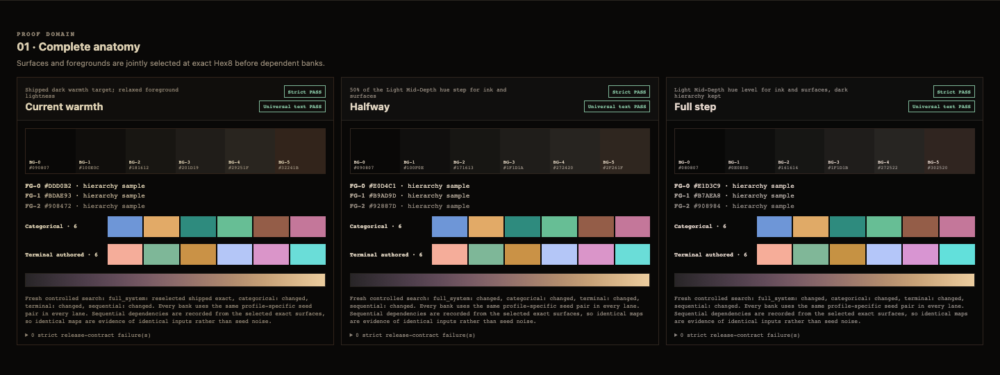 | 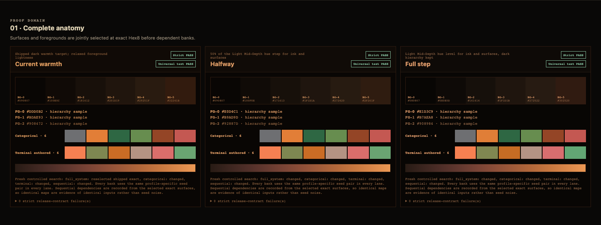 |
| 2000K Dark | 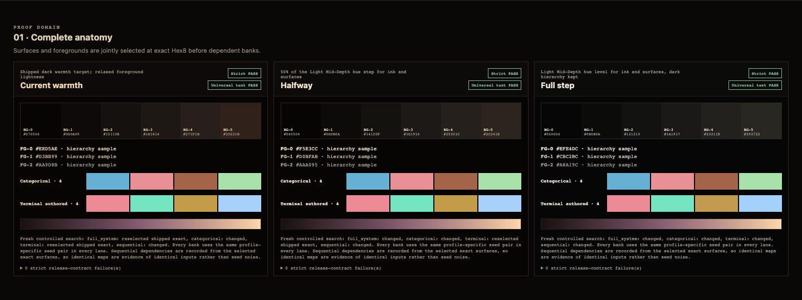 | 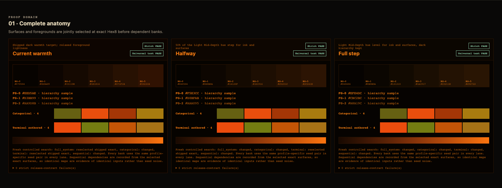 |
| 1200K Dark | 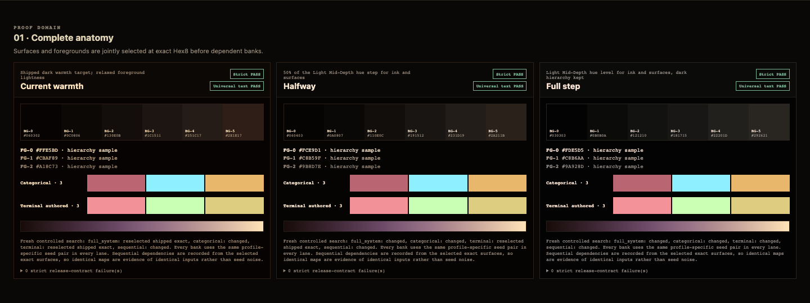 | 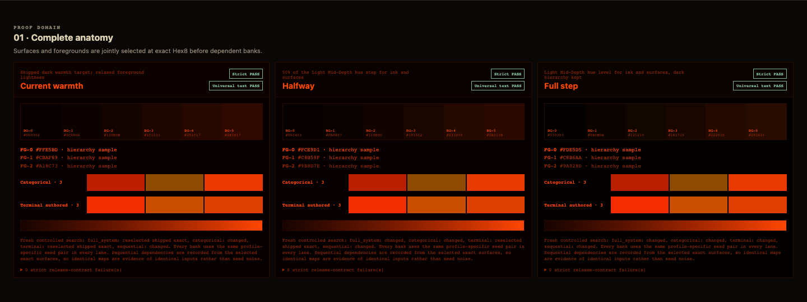 |

### Full proof domains in 3400K Dark

| Domain | Commanded | Exact simulated |
|---|---|---|
| Terminal | 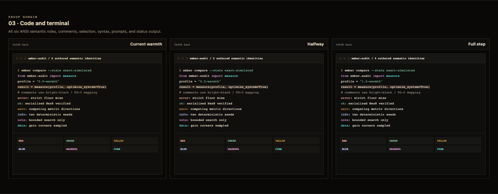 | 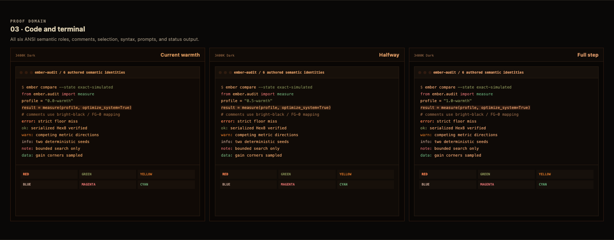 |
| Dashboard | 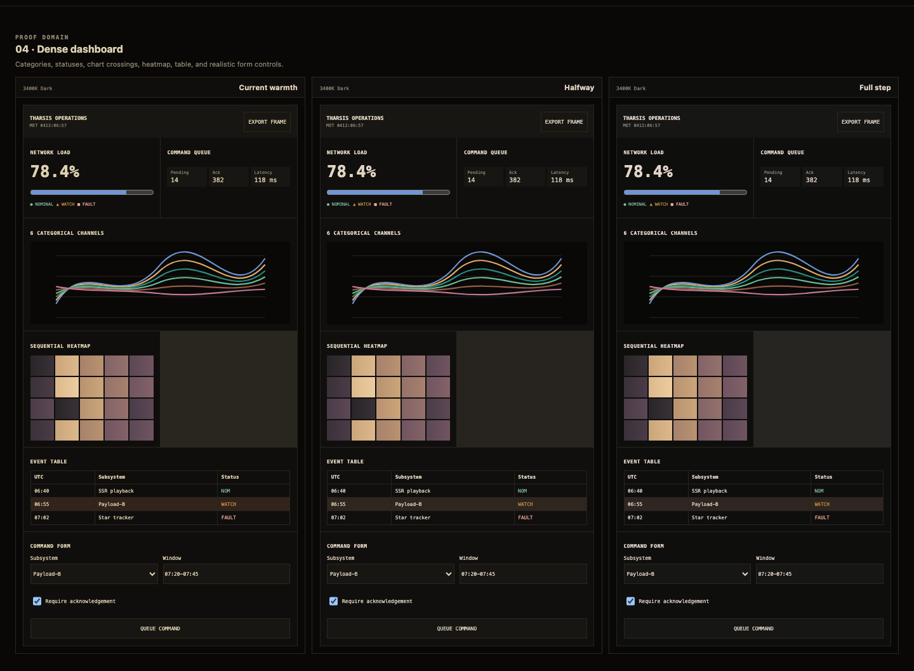 | 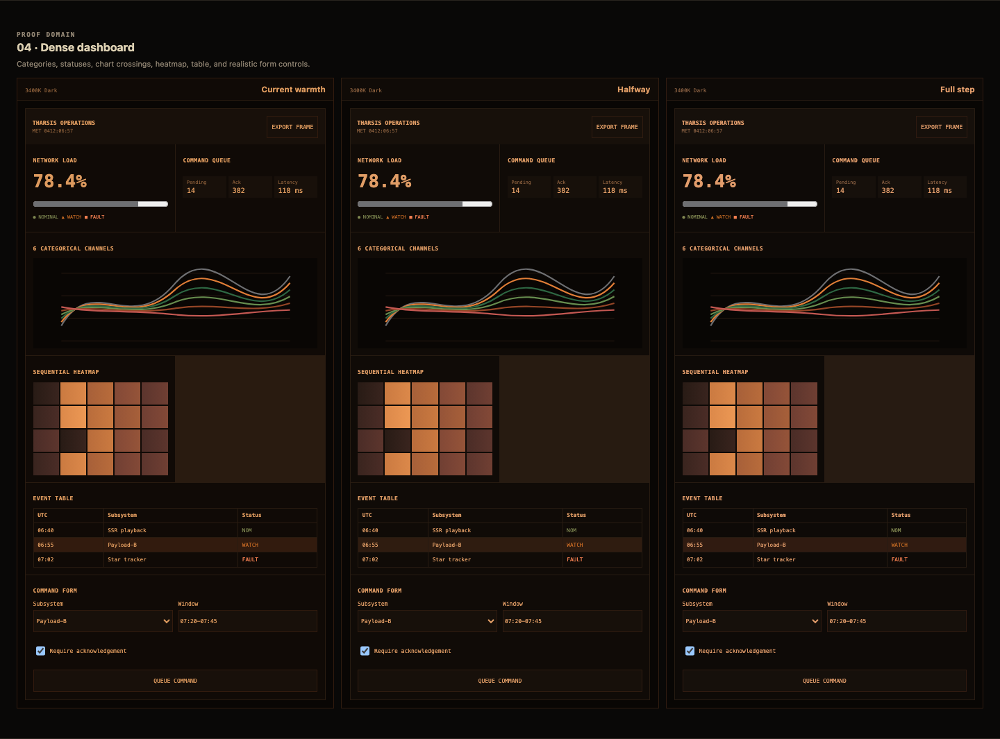 |
| Science and images | 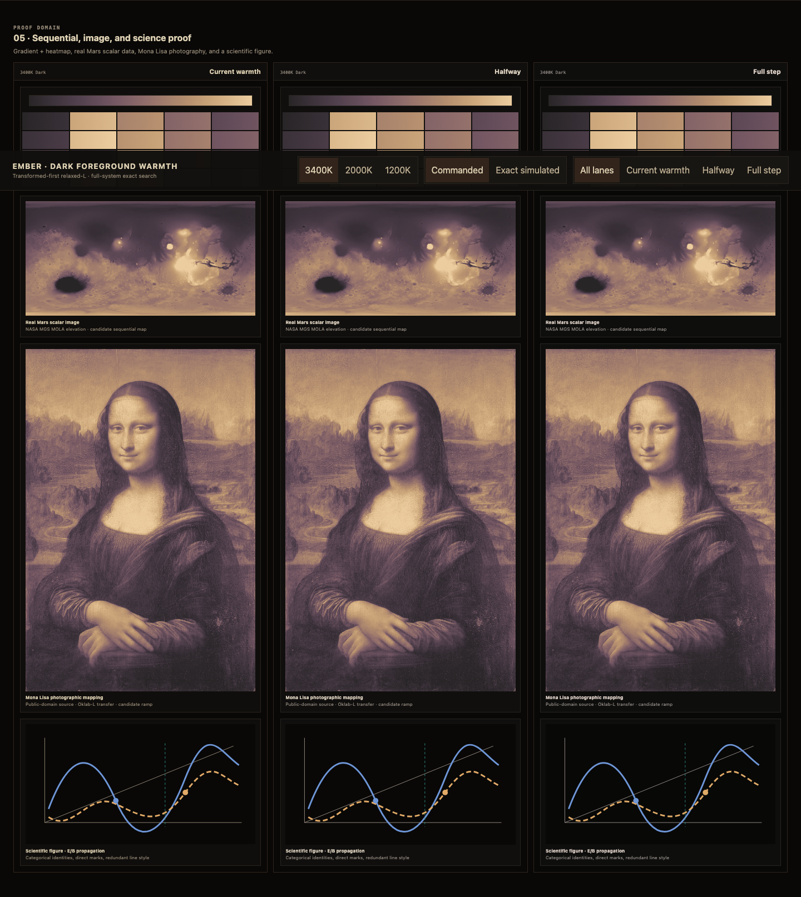 | 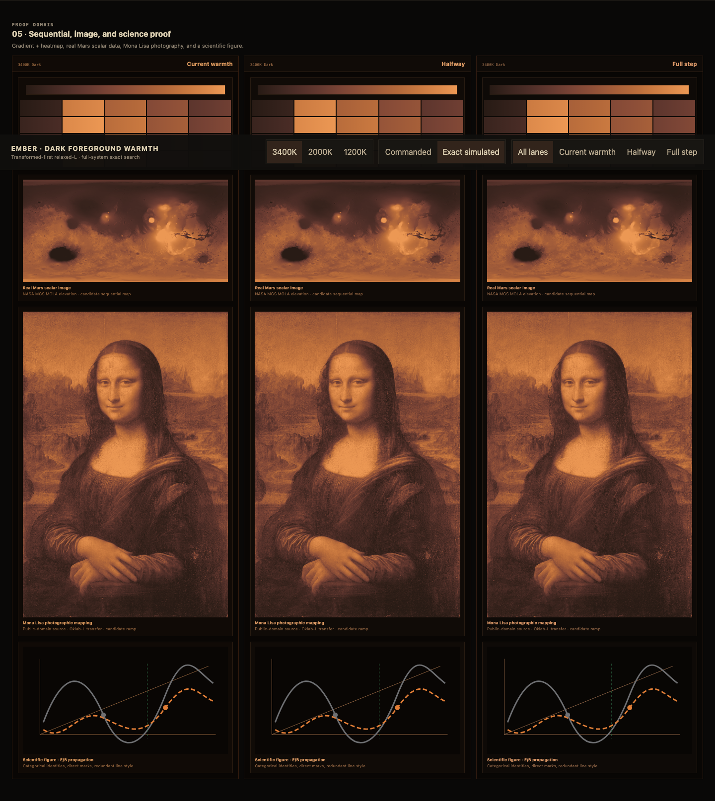 |

### Phone-width focused state

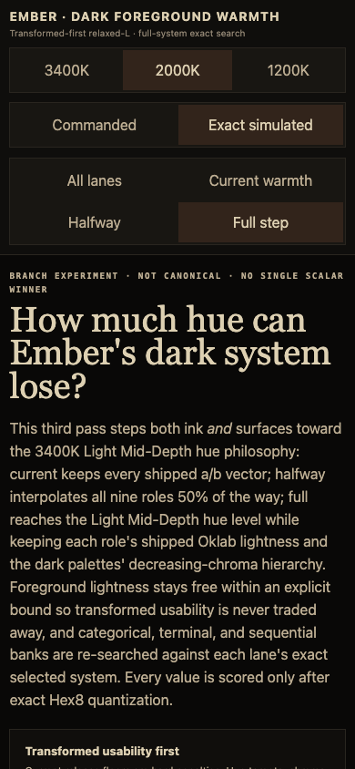

## Exact values

### 3400K Dark

#### Current warmth

```text
Surfaces:    090807 100E0C 181612 201D19 29251F 32241B
Foregrounds: DDD0B2 BDAE93 908472
Categorical: 6E96D7 E2AA67 2E8B7E 67BE95 945D48 C4779A
Terminal:    F5AD9A 7EB798 CA9246 B4C6F7 DA95C9 6ADDD8
Sequential:  282527 51404F 7F5E69 A17C6C C49D70 ECCD9F
```

#### Halfway

```text
Surfaces:    090807 100F0E 171613 1F1D1A 272420 2F261F
Foregrounds: E0D4C1 B9AD9D 92887D
Categorical: 6E96D7 E2AA67 2E8B7E 67BE95 945D48 C4779A
Terminal:    F5AD9A 7EB798 CA9246 B4C6F7 DA95C9 6ADDD8
Sequential:  282527 51404F 7F5E69 A17C6C C49D70 ECCD9F
```

#### Full step

```text
Surfaces:    080807 0E0E0D 161614 1F1D1B 272522 302520
Foregrounds: E1D3C9 B7AEA8 908984
Categorical: 6E96D7 E0AA67 2E8B7E 67BE95 945D48 C4779A
Terminal:    F6AD99 80B798 C69243 B4C6F9 D895D2 62E0DB
Sequential:  282527 51404F 7F5E69 A17C6C C49D70 ECCD9F
```

### 2000K Dark

#### Current warmth

```text
Surfaces:    070504 0D0A09 15110E 1E1814 271F1B 30221B
Foregrounds: EED5AE D3BB99 AA9D8B
Categorical: 66B0D4 E99096 A46449 A8E2AA
Terminal:    EC8B96 74E5C0 C39C49 A7D1FB
Sequential:  18110E 4B343E 785167 A27882 C59A8B FCD6AB
```

#### Halfway

```text
Surfaces:    060504 0D0B0A 14120F 1D1916 25201C 2C241E
Foregrounds: F5E3CC D0BFAB AAA095
Categorical: 66B0D4 E99096 A46449 A8E2AA
Terminal:    EC8B96 74E5C0 C39C49 A7D1FB
Sequential:  18110E 4B343E 785167 A27882 C59A8B FCD6AB
```

#### Full step

```text
Surfaces:    060606 0B0B0A 121210 1A1917 23211E 292722
Foregrounds: EFE4DC CBC2BC A8A19C
Categorical: 66B0D4 E99096 A46449 A8E2AA
Terminal:    EC8B96 74E5C0 C39B50 A4D0FC
Sequential:  18110E 4B343E 785167 A27882 C59A8B FCD6AB
```

### 1200K Dark

#### Current warmth

```text
Surfaces:    060302 0C0806 130E0B 1C1511 251C17 2E1E17
Foregrounds: FFE5BD CBAF89 A18C73
Categorical: BB6572 8EF0FF E9B76C
Terminal:    F29298 C9FFB4 DDCD81
Sequential:  170B09 4B3042 6F4C6D 967186 BD9995 FFE3B7
```

#### Halfway

```text
Surfaces:    060403 0A0807 110E0C 191512 231D19 2A211B
Foregrounds: FCE9D1 C8B59F 9B8D7E
Categorical: B96572 8EF0FF E8B76C
Terminal:    F29298 C9FFB4 DDCD81
Sequential:  170B09 4B3042 6F4C6D 967186 BD9995 FFE3B7
```

#### Full step

```text
Surfaces:    030303 0B0B0A 121210 181715 22201D 292621
Foregrounds: FDE5D5 C8B6AA 9A928D
Categorical: B96572 8EF0FF E8B76C
Terminal:    F39399 CAFFB4 DECC80
Sequential:  170B09 4B3042 6F4C6D 967186 BD9995 FFE3B7
```

## Search provenance and reproducibility

- Exact selected data, unrounded metrics, per-seed objectives, bounds, changed/reselected flags, continuous float maps, Hex8 previews, and sampled gain corners: [`search-results.json`](search-results.json)
- Reproducible bounded search: [`search_full_palette.py`](search_full_palette.py)
- Deterministic renderer: [`../../../tools/render_dark_foreground_warmth_experiment.py`](../../../tools/render_dark_foreground_warmth_experiment.py)
- Independent verification: [`../../../tests/test_dark_foreground_warmth_experiment.py`](../../../tests/test_dark_foreground_warmth_experiment.py)

The simulated state applies each family's documented encoded-sRGB diagonal gain vector. The ±5% samples scale nonzero G/B gains only; exact zero blue remains zero.

## Promotion boundary

Nothing here is canonical. If a warmth lane is chosen, promotion is a separate pass that must update authoritative definitions, transformed targets, generated exports, release invariants, public documentation, and downstream themes. Experimental prose, failed candidates, and comparison-only assets should not leak into the production reader path.
